**apis-service\_center Specification**
=====
**Rev 0.6**

# **目次**
- [**apis-service\_center Specification**](#apis-service_center-specification)
- [**目次**](#目次)
- [**1. 用語・略語**](#1-用語略語)
- [**2. 概要**](#2-概要)
- [**3. ソフトウェア構成**](#3-ソフトウェア構成)
  - [**3.1. ソフトウェア概要**](#31-ソフトウェア概要)
  - [**3.2. ソフトウェア接続構成**](#32-ソフトウェア接続構成)
- [**4. ユーザインタフェース**](#4-ユーザインタフェース)
  - [**4.1. ログイン画面**](#41-ログイン画面)
  - [**4.2. 管理者画面**](#42-管理者画面)
    - [**4.2.1. Community及びCluster選択**](#421-community及びcluster選択)
    - [**4.2.2. 表示選択**](#422-表示選択)
    - [**4.2.3. VISUAL**](#423-visual)
    - [**4.2.4. AVAILABILITY**](#424-availability)
    - [**4.2.5. DEAL**](#425-deal)
    - [**4.2.6. MONITORING**](#426-monitoring)
  - [**4.3. ユーザ画面**](#43-ユーザ画面)
    - [**4.3.1. Community, Cluster 及びUnit選択**](#431-community-cluster-及びunit選択)
    - [**4.3.2. 表示選択**](#432-表示選択)
    - [**4.3.3. VISUAL**](#433-visual)
    - [**4.3.4. DEAL**](#434-deal)
    - [**4.3.5. SCENARIO**](#435-scenario)
- [**5. Service Center Server**](#5-service-center-server)
  - [**5.1. アプリケーション概要**](#51-アプリケーション概要)
  - [**5.2. “api” アプリケーション**](#52-api-アプリケーション)
  - [**5.3. “apis\_log” アプリケーション**](#53-apis_log-アプリケーション)
  - [**5.4. “community” アプリケーション**](#54-community-アプリケーション)
  - [**5.5. “core” アプリケーション**](#55-core-アプリケーション)
  - [**5.6. “deal” アプリケーション**](#56-deal-アプリケーション)
  - [**5.7. “downtime” アプリケーション**](#57-downtime-アプリケーション)
  - [**5.8. “monitoring” アプリケーション**](#58-monitoring-アプリケーション)
  - [**5.9. “scenario” アプリケーション**](#59-scenario-アプリケーション)
  - [**5.10. “unit\_data” アプリケーション**](#510-unit_data-アプリケーション)
- [**6. Service Centerへの各種登録**](#6-service-centerへの各種登録)
- [**7. 通信仕様**](#7-通信仕様)
  - [**7.1. Service Center Web API**](#71-service-center-web-api)
- [**8. configについて**](#8-configについて)
  - [**8.1. config/**](#81-config)
- [**9. Log出力**](#9-log出力)
- [**10. 異常処理**](#10-異常処理)
- [**11. セキュリティ**](#11-セキュリティ)
- [**12. プライバシー**](#12-プライバシー)
- [**13. OSSライセンス**](#13-ossライセンス)

 

# **1. 用語・略語**

<table>
<thead>
<tr class="header">
<th><strong>用語</strong></th>
<th><strong>説明</strong></th>
</tr>
</thead>
<tbody>
<tr class="odd">
<td>apis-main</td>
<td>
自律分散制御を可能にする電力相互融通ソフトウェアである。

(詳細はapis-main仕様書を参照。)
</td>
</tr>
<tr class="even">
<td>apis-ccc</td>
<td>電力融通に関わる情報をサーバ等の外部Serviceにアップロードし、各ノードの設定ファイルをサーバからDownloadするクライアントソフトウェアである。(詳細はapis-ccc仕様書を参照。)</td>
</tr>
<tr class="odd">
<td>apis-log</td>
<td>apis-main等がコミュニケーションラインにマルチキャストで出力する情報を受信しJSON形式に整えた上でデータベースに書き込みを行うソフトウェアである。(詳細はapis-log仕様書を参照。)</td>
</tr>
<tr class="even">
<td>Grid Master</td>
<td>apis-mainに含まれるServiceの名称でDC Gridを制御し電力融通を実現する。</td>
</tr>
<tr class="odd">
<td>Scenario</td>
<td>apis-mainで使用されるJSON形式のファイルで電力融通のために必要なBattery残容量毎のBattery充放電要求が記載されている。</td>
</tr>
<tr class="even">
<td>Vert.x</td>
<td>負荷分散プログラムのフレームワーク。Hazelcastライブラリを利用してEvent Busをクラスタ化しネットワーク上で負荷分散処理を行う。</td>
</tr>
</tbody>
</table>

 

# **2. 概要**

Service Centerは、各Unitにインストールされたapis-mainによって構築されるClusterの管理者とユーザそれぞれに対して必要な情報を提供するWebアプリケーションである。管理者に対しては主に運用を目的として全Unitのステータス情報と電力融通情報をリアルタイムで表示し、全Unitの電力融通履歴、異常通知、稼働率等を提供する。ユーザに対しては電力融通Systemの稼働状況を通知する目的で自Unitのステータス情報と電力融通情報をリアルタイム表示し、電力融通履歴やScenarioと呼ばれる電力融通を行う際のルール設定を変更するための機能を提供する。図2-1で示すようにService Centerはエリア毎に複数のClusterを束ねてCommunityという単位で管理する。

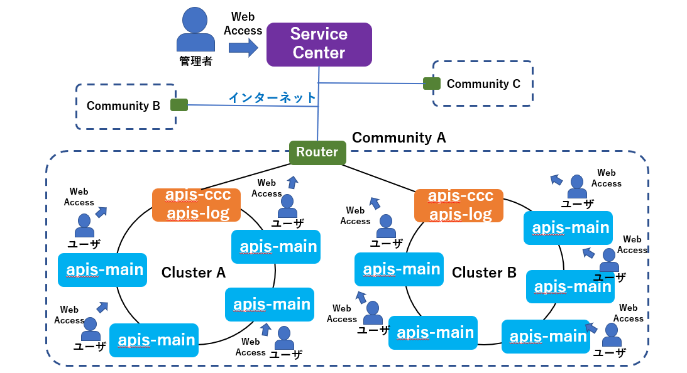
図2-1

 

# **3. ソフトウェア構成**

## **3.1. ソフトウェア概要**

Service Centerのソフトウェア構成を図3-1に示す。基本的にはDjango フレームワークの規則に従って実装されており、様々な機能を提供する複数のアプリケーションで構成されている。アプリケーションは管理者用とユーザ用の機能を提供しており、アクセスするURLにより提供する機能が異なる。管理者やユーザとのインターフェースに関しては標準的な構成ではあるが、HTMLでWebコンテンツの構造を作成し、CSSにて飾り付けを行ってJavaScriptでService Center Server上のアプリケーションとコミュニケーションを行う。HTML, JavaScript, CSSなどStaticなファイルはサンプルとしてDjango Service Centerのアプリケーションの一つとして提供されているが、このStaticなファイルを切り出し任意のWeb Serverを用いてデプロイすることができるため、ユーザインタフェース部とService Center部それぞれ独立したServer上に配置することも可能である。

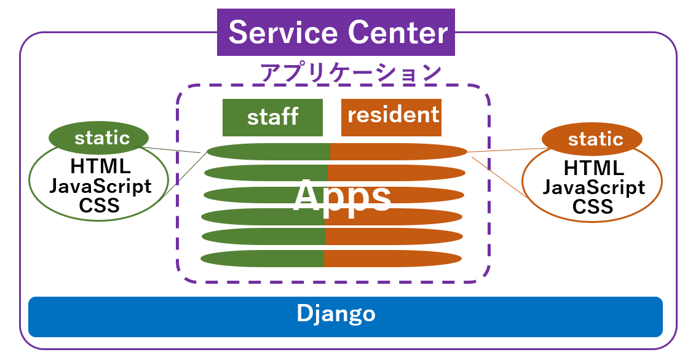
staff = 管理者 , resident = ユーザ  
図3-1

 

## **3.2. ソフトウェア接続構成**

Service Centerのソフトウェア接続構成を以下の図3-2に示す。管理者は管理者用のURLにHTTPアクセスを行ってアカウントとパスワードを入力することで管理者用の機能を利用することができる。ユーザはユーザ用のURLにHTTPアクセスを行ってアカウントとパスワードを入力することでユーザ用の機能を利用することができる。ログイン後はDownloadしたJavaScriptが管理者もしくはユーザの操作により各アプリケーションとコミュニケーションを取りながら機能を提供する。apis-cccとapis-logはCluster内のapis-mainから電力融通情報や、実行Log等を取得してData Baseに登録する。Service Centerの各アプリケーションは必要応じてData Baseにアクセスし登録された情報を元に管理者もしくはユーザに必要な機能を提供する。(apis-main, apis-ccc, apis-logの詳細は各仕様書を参照すること。)

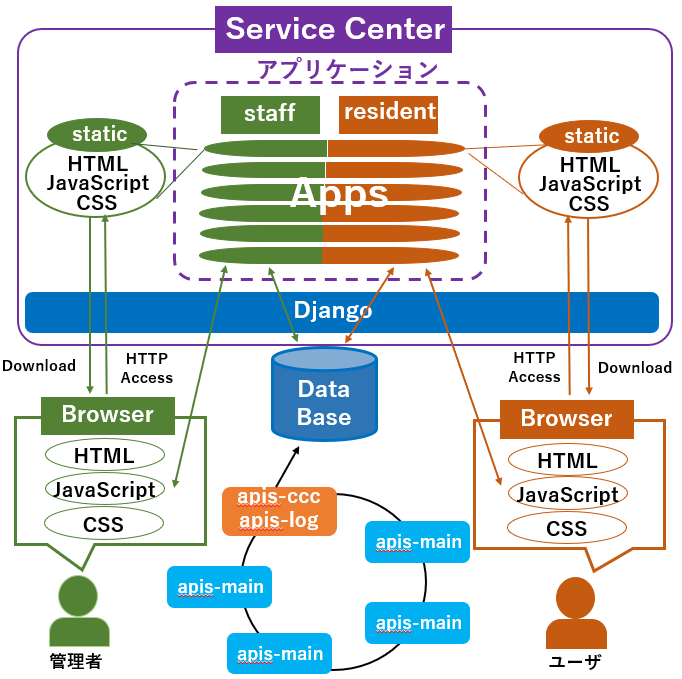  
図3-1

 

# **4. ユーザインタフェース**
    
## **4.1. ログイン画面**

図4-1にService Center のログイン画面を示す。 この画面は管理者用URLもしくはユーザ用URLにアクセスした際に最初に表示される。管理者用の機能を利用するためには管理者用のURLにアクセスし管理者のアカウントとパスワードを入力する必要があり、ユーザ用の機能を利用するためにはユーザ用のURLにアクセスしユーザのアカウントとパスワードを入力する必要がある。一度アカウントとパスワードを入力するとブラウザにより保存され、次回からスムーズにログイン可能である。

githubからDownload可能なService Centerでは以下のusername, passwordでアクセスできる。

\[管理者\]  
&emsp;username : admin  
&emsp;password : admin  
\[ユーザ\]  
&emsp;username : e001 (e002, e003, e004もそれぞれ可)  
&emsp;password : e001 (e002, e003, e004もそれぞれ可)

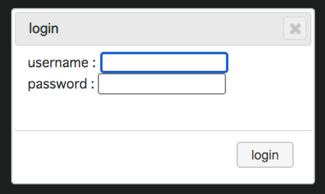  
図4-1  
 

## **4.2. 管理者画面**
    
### **4.2.1. Community及びCluster選択**

管理者用URLにアクセスすると以下のようにCommunityとそれに属するClusterを選択する画面が表示される。”community” 及び ”cluster”それぞれのプルダウンメニューを押下すると既に登録されている情報が表示される。  
   
※displayで表示される各HTMLのタイトルをクリックするとこの画面が表示されて  
&ensp;他のcommunityやcluster　またdisplayの表示を変えることが可能である。  

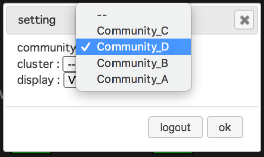  
図4-2  

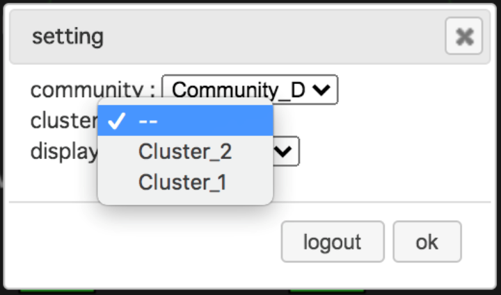  
図4-3

 

### **4.2.2. 表示選択**

図4-4に示すように”display”のプルダウンメニューを押下すると以下にListしたように4つの選択肢が表示される。
 
\[表示\]  
&emsp;\-VISUAL :  
&emsp;&emsp;電力融通及び各Unitの状態をリアルタイムに表示する。  
&emsp;\-AVAILABILITY :  
&emsp;&emsp;期間を指定することで全Unitの平均及び各Unitの稼働率等の情報を表示する。  
&emsp;\-DEAL :  
&emsp;&emsp;Cluster全体の電力融通履歴等を表示する  
&emsp;\-MONITORING :  
&emsp;&emsp;Cluster内の障害管理と各Unitのapis-mainや 情報を取得してData Baseに上げる  
&emsp;&emsp;apis-ccc, apis-logなどの死活監視のON/OFF画面や各種障害検知を表示する。

  
図4-4

 

### **4.2.3. VISUAL**

VISUALは電力融通及び各Unitの状態をリアルタイムに表示する。図4-5はhouse001～house004の4つのUnitが表示されている。 house002からhouse001へ、そしてhouse002からhouse003へとドットラインで結ばれており、これはhouse002からhouse001とhouse003へ電力融通が行われていることを示している。また、house001上の王冠マークはhouse001がGrid Masterである事を示している。 (Grid Masterや電力融通の仕組みに関しては apis-main仕様書を参照すること。)

githubからDownload可能なService Centerでは以下のURLでアクセス可能である。

http://127.0.0.1:8000/static/ui\_example/staff/visual.html

  
図4-5

 

### **4.2.4. AVAILABILITY**

AVAILABILITYはCluster内の全Unitの平均及び、各Unitの稼働率を表示する。期間

\<例 : ”2020-01-01” – “2020-01-07”\> を入力し”aggregate”ボタンを押下することで図4-6に示すように先頭にCluster内の全Unitの平均を表示し、その下に各Unitの稼働率等の結果が表示される。

githubからDownload可能なService Centerでは以下のURLでアクセス可能である。

http://127.0.0.1:8000/static/ui\_example/staff/availability.html

  
図4-6
 

各Unitの横にある “detail” ボタンを押下すると図4-7のように個別の情報が表示される。  
  
図4-7

 

### **4.2.5. DEAL**

DEALは電力融通履歴を表示する。日付\<例 : ”2020-01-01” \>を入力し”aggregate” ボタンを押下することで図4-8に示すように入力した日に発生した全Unitの電力融通情報を時間毎に棒線で表示する。折れ線はCluster内全Unitの全融通期間の平均である。

githubからDownload可能なService Centerでは以下のURLでアクセス可能である。

http://127.0.0.1:8000/static/ui\_example/staff/deal.html

  
  
図4-8
 
Summaryの下にある“detail”ボタンを押下することでより図4-9に示すように各電力融通の情報が列挙される。  
  
図4-9
 
さらに各電力融通の横に表示される”detail” ボタンを押下することで図4-10に示すように、その取引の詳細が表示される。  

図4-10

 

### **4.2.6. MONITORING**

MONITORINGは図4-11、図4-12で示すようにCluster内のapis-main, apis-ccc, Grid Masterの死活監視と障害検知の機能のON/OFF画面や発生した障害情報を表示する。死活監視や、障害検知のON/OFFはソフトウェア名の横にあるチェックボックをチェックすると切り替えることができる。緑表示がONで赤表示がOFFを表す。

githubからDownload可能なService Centerでは以下のURLでアクセス可能である。

http://127.0.0.1:8000/static/ui\_example/staff/monitoring.html

  
図4-11
 
  
図4-12
 
さらに各障害の横に表示される”detail” ボタンを押下することで図4-13に示すように、その障害の詳細が表示される。  
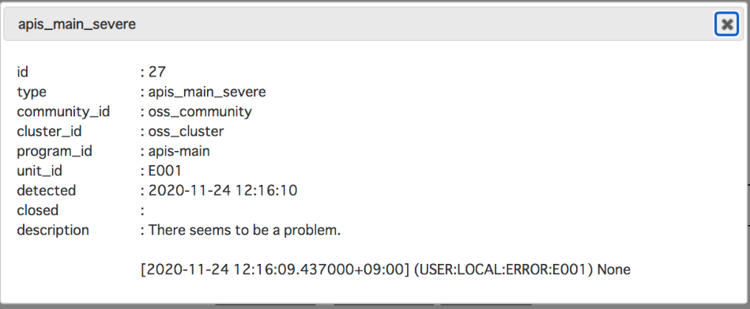  
図4-13
 

## **4.3. ユーザ画面**

### **4.3.1. Community, Cluster 及びUnit選択**

図4-14に示すようにユーザ用URLにアクセスすると管理者用URLにアクセスしたようにCommunityとそれに属するClusterを選択する画面が表示される。さらにユーザ用画面には”unit” に情報を表示させたいUnit IDを選択する必要がある。”community” 、”cluster”及び “unit”それぞれのプルダウンメニューを押下すると既に登録されている情報が表示される。

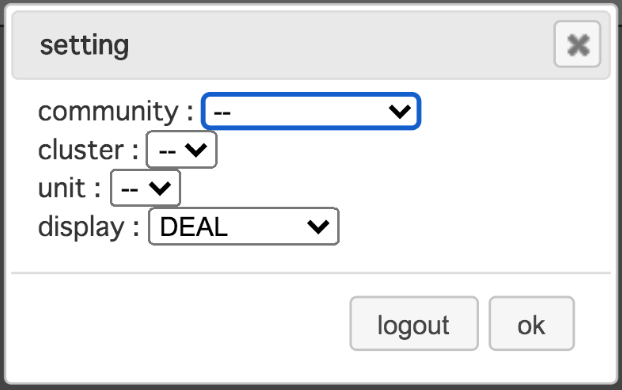  
図4-14

 

### **4.3.2. 表示選択**

図4-15に示すように“display”のプルダウンメニューを押下すると以下にListしたように3つの選択肢が表示される。

\[表示\]  
&emsp;\-VISUAL :  
&emsp;&emsp;指定Unitの電力融通及び状態をリアルタイムに表示する。  
&emsp;\-DEAL :  
&emsp;&emsp;指定Unitの電力融通履歴等を表示する。  
&emsp;\-SCENARIO:  
&emsp;&emsp;電力融通の挙動を決定する行動ルールを変更する。  

  
図4-15

 

### **4.3.3. VISUAL**

ユーザ用のVISUALは自Unitのみの電力融通及び状態をリアルタイムに表示する。図4-16の左図は電力融通を行っていない状態の表示であり、右図は電力融通を行っている状態の表示である。電力融通を行っている最中は融通を行っている数だけUnitが表示されるが、個人情報保護のため、電力融通を行っている他のUnit情報は表示されない。右図は2つの他Unitへ電力融通を行っている様子である。影のように表示されているUnitが他Unitである。

githubからDownload可能なService Centerでは以下のURLでアクセス可能である。

http://127.0.0.1:8000/static/ui\_example/resident/visual.html

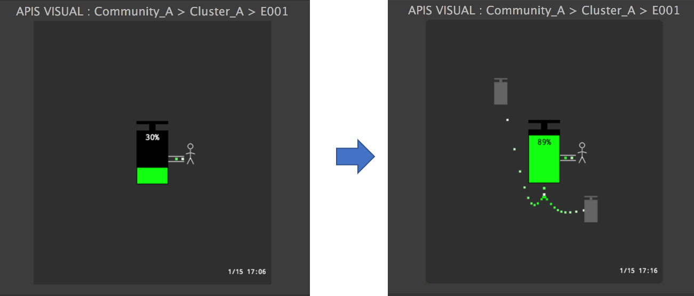  
図4-16

### **4.3.4. DEAL**

ユーザ用のDEALは自Unitの電力融通履歴を表示する。日付　\<例 : ”2020-01-01” \>を入力し”aggregate” ボタンを押下することで図4-17に示すように入力した日に発生した全Unitの電力融通情報を時間毎に棒線で表示する。折れ線は該当Unitの全融通期間の平均である。githubからDownload可能なService Centerでは以下のURLでアクセス可能である。

http://127.0.0.1:8000/static/ui\_example/resident/deal.html

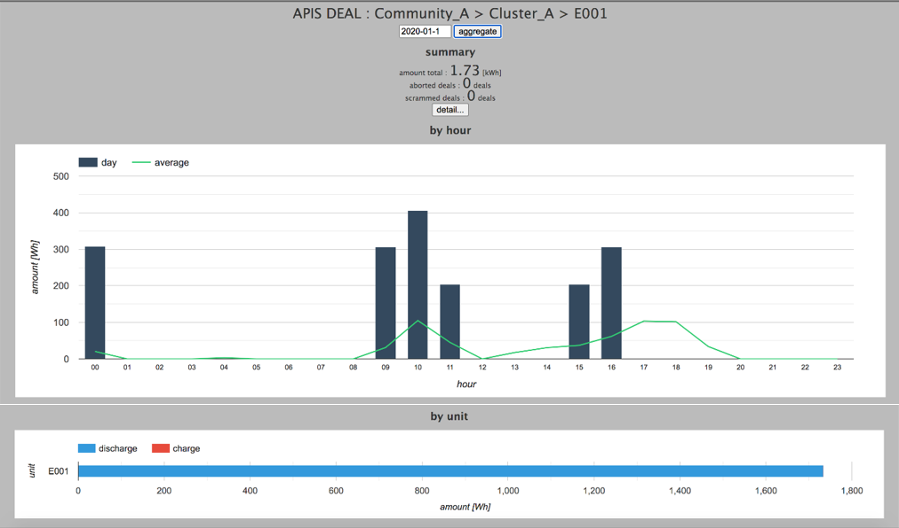  
図4-17
 
Summaryの下にある“detail”ボタンを押下することでより図4-18に示すように各電力融通の情報が列挙される。  
  
図4-18
 
さらに各電力融通の横に表示される”detail” ボタンを押下することで図4-19に示すように、その取引の詳細が表示される。  
  
図4-19  

 

### **4.3.5. SCENARIO**

ユーザ用のSCENARIOは自Unitの電力融通の挙動を決定する行動ルールを変更する。ユーザはSCENARIOに表示される各Scenarioを選択することで電力融通の行動ルールを変更することができる。図4-20では例として以下4つのScenarioが選択できるが、Scenarioの数は管理者が登録することで増やすことが可能である。(Scenario登録は6.Service Centerへの各種登録参照)

githubからDownload可能なService Centerでは以下のURLでアクセス可能である。

http://127.0.0.1:8000/static/ui\_example/resident/scenario.html

  
図4-20
 
Scenarioを選択するためには各Scenario横の”choose” ボタンを押下することで選択できる。”detail” ボタンを押下することで図4-21に示すようにScenarioのJSONファイルを確認することが可能である。(ScenarioのJSONファイルの情報についてはapis-main仕様書参照)
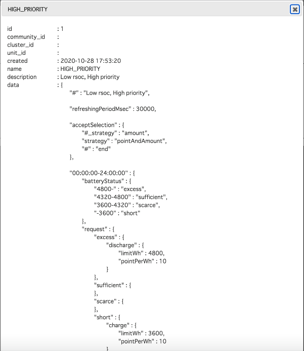  
図4-21

 

# **5. Service Center Server**

## **5.1. アプリケーション概要**

Service CenterはDjango フレームワーク上の以下のアプリケーションで構築されている。

　・”api” アプリケーション

各アプリケーションが提供するAPIを束ねて外部に公開する。

* ”apis\_log” アプリケーション
  * apis-log用のモデルを保持し、各アプリケーションのリクエストに応じてMongoDBからapis-logが保存した情報を取得する。
* ”community” アプリケーション
  * CommunityやCluster、Unit用のモデルを保持し、各アプリケーションのリクエストに応じてSqliteからCommunityやCluster、Unit等の情報を取得する。
* ”core” アプリケーション
  * ログイン、ログアウトなど管理者やユーザを認証する。
* ”deal” アプリケーション
  * Deal用のモデルを保持し、MongoDBから融通情報を取得する。
* ”downtime” アプリケーション
  * Downtime用のモデルを保持しMongoDBからUnit Dataを取得し稼働率を計算する。
* ”monitoring” アプリケーション
  * 障害監視用のモデルを保持しapis-logがMongoDBに保存した情報を元に死活監視、障害検知を行う。
* ”scenario” アプリケーション
  * Scenario用のモデルを保持し、Battery残容量ごとの電力融通に対するリクエストやアクセプトなどを決定するルールをSqliteより取得し各Unitのapis-mainへ配布する。
* ”unit\_data” アプリケーション
  * Unit Data用のモデルを保持し、MongoDBから各UnitのUnit Dataの情報を取得する。

 
以後の章で、各アプリケーションの詳細を説明する。

 

## **5.2. “api” アプリケーション**

以下に”api” アプリケーションのファイル構成を示す。(基本的にはDjangoフレームワークのルールに従った構成となっている。)

▼static/ui\_example

ユーザ及び管理者用のHTML画面のサンプルファイルが置かれている。

* /resident
  * css  
     ユーザ用の画面構築に使用されるcssファイルをまとめたフォルダ。
  * js  
     ユーザ用の画面構築に使用されるJavaScriptファイルをまとめたファルダ。
  * deal.html  
     ユーザのDEAL表示画面用HTMLファイル。
  * scenario.html  
     ユーザのSCENRIO表示画面用HTMLファイル。
  * visual.html  
     ユーザのVISUAL表示画面用HTMLファイル。
* /staff
  * css  
     管理者用の画面構築に使用されるcssファイルをまとめたフォルダ。
  * js  
     管理者用の画面構築に使用されるJavaScriptファイルをまとめたファルダ。
  * availability.html  
     管理者のAVAILABILITY表示画面用HTMLファイル。
  * deal.html  
     管理者のDEAL表示画面用HTMLファイル。
  * monitoring.html  
     管理者のMONITORING表示画面用HTMLファイル。
  * visual.html  
     管理者のVISUAL表示画面用HTMLファイル。
 

▼static/api

client.jsの評価を行うためのテスト用htmlである。Session評価や、Data Baseからの情報取得等の評価を行うことが可能である。

* resident/client\_example.html
* staff/client\_example.html

▼templates/api

JavaScript用のtemplateが置かれているフォルダ。ユーザ用と管理者用にそれぞれ以下のように配置されている。

* resident/client.js  
  static/ui\_example以下のJavaScriptと共にユーザのブラウザ上にDownloadされService Center の各アプリケーションとのインターフェースとなるJavaScriptである。
* staff/client.js  
  static/ui\_example以下のJavaScriptと共に管理者のブラウザ上にDownloadされService Center の各アプリケーションとのインターフェースとなるJavaScriptである。
 

▼urls

* \_init\_.py
  * “api”アプリケーションの下のurls記述ファイル。  
   以下のWeb APIアクセスを受けてそれぞれのurls記述ファイルの場所を示す。
  
    * /api/core/xxx  
     →”core”アプリケーションの下のurls.pyファイルを示す。
    * /api/staff/xxx  
     →”api”アプリケーションの下のurlsフォルダの下のstaff.pyファイルを示す。
    * /api/resident/xxx  
     →”api”アプリケーションの下のurlsフォルダの下のresident.pyファイルを示す。
    * /api/misc/xxx  
     →”api”アプリケーションの下のurlsフォルダの下のmisc.pyファイルを示す。

* misc.py
  * “api”アプリケーションの下のurls記述ファイル。  
   以下のWeb APIアクセスを受けてurls記述ファイルの場所を示す。
    * /api/misc/scenario/xxx  
     →scenarioアプリケーションの下のurlsフォルダのmisc.pyを示す。

* resident.py
  * “api”アプリケーションの下のurls記述ファイル。  
   以下のWeb APIアクセスを受けてそれぞれのurls記述ファイルの場所を示す。

    * /api/resident/client.js  
     →”api”アプリケーションの下のresident/client.js templateをレンダリングする。
    * /api/resident/community/xxx
     →”community”アプリケーションの下のurlsフォルダのresident.pyを示す。
    * /api/resident/unitData/xxx  
     →”unit\_data”アプリケーションの下のurlsフォルダのresident.pyを示す。
    * /api/resident/deal/xxx  
     →”deal”アプリケーションの下のurlsフォルダのresident.pyを示す。
    * /api/resident/scenario/xxx  
     →”scenario”アプリケーションの下のurlsフォルダのresident.pyを示す。

* staff.py
  * “api”アプリケーションの下のurls記述ファイル。  
   以下のWeb APIアクセスを受けてそれぞれのurls記述ファイルの場所を示す。

    * /api/staff/client.js  
     →”api”アプリケーションの下のstaff/client.js templateをレンダリングする
    * /api/staff/community/xxx  
     →”community”アプリケーションの下のurlsフォルダのstaff.pyを示す。
    * /api/staff/unitData/xxx  
     →”unit\_data”アプリケーションの下のurlsフォルダのstaff.pyを示す。
    * /api/staff/deal/xxx  
     →”deal”アプリケーションの下のurlsフォルダのstaff.pyを示す。
    * /api/staff/downtime/xxx  
     →”downtime”アプリケーションの下のurlsフォルダのstaff.pyを示す。
    * /api/staff/monitoring/xxx  
     →”monitoring”アプリケーションの下のurlsフォルダのstaff.pyを示す。

 

▼\_init\_.py  
Django フレームワーク自動生成のファイル。中身は空。
 

▼admin.py  
Django フレームワーク自動生成のファイル。中身は空。
 

▼apps.py  
config/settings/base.pyのINSTALLED\_APPSに登録し、起動時に実行する処理を記述する。ApiConfig Classが定義されている。
 

▼modelst.py  
Django フレームワーク自動生成のファイル。中身は空。
 

▼tests.py  
Django フレームワーク自動生成のファイル。中身は空。
 

▼views.py  
Django フレームワーク自動生成のファイル。中身は空。

 

## **5.3. “apis\_log” アプリケーション**

以下に”apis\_log” アプリケーションのファイル構成を示す。(基本的にはDjangoフレームワークのルールに従った構成となっている。)

▼\_init\_.py  
Django フレームワーク自動生成のファイル。中身は空。
 

▼admin.py  
Django フレームワーク自動生成のファイル。中身は空。
 

▼apps.py  
config/settings/base.pyのINSTALLED\_APPSに登録し、起動時に実行する処理を記述する。ApisLogConfig Classが定義されている。
 

▼modelst.py  
以下のモデルがClassとして登録されている。
* ApisLog  
 APISの実行Logを表すモデル。  
 Community, Cluster, Unitや期間など条件を指定し、その条件にあったLogの件数やList、情報等をMongoDBから取得して返す。
 

▼tests.py  
Django フレームワーク自動生成のファイル。中身は空。
 

▼views.py  
Django フレームワーク自動生成のファイル。中身は空。
 

 

## **5.4. “community” アプリケーション**

以下に”community” アプリケーションのファイル構成を示す。(基本的にはDjangoフレームワークのルールに従った構成となっている。)

▼fixtures  

* example.json  
 SqliteにCommunity, Cluster, Unit等の情報を一括して登録する際に使用されるJSONファイル。
 

▼migrations  
model.pyで定義されたモデルのMigration作業の際に自動で作成されるファイル。
 

▼urls

* resident.py
  * “community”アプリケーションの下のurls記述ファイル。  
   以下のWeb APIアクセスを受けて実際に処理を行う関数の場所を示す。

    * /api/resident/community/outline
     →”community”アプリケーションの下の views.pyの中のresident\_outline関数を示す。
* staff.py
  * “community”アプリケーションの下のurls記述ファイル。  
   以下のWeb APIアクセスを受けて実際に処理を行う関数の場所を示す。
    * /api/staff/community/outline
     →”community”アプリケーションの下の views.pyの中のoutline関数を示す。

▼\_init\_.py  
Django フレームワーク自動生成のファイル。中身は空。
 

▼admin.py  
models.pyで定義したモデルをadmin画面で登録/編集ができるようにUnitAdmin Classが定義されている。
 

▼apps.py  
config/settings/base.pyのINSTALLED\_APPSに登録し、起動時に実行する処理を記述する。CommunityConfig Classが定義されている。
 

▼models.py  

以下のモデルがClassとして定義されている。
* Community  
 Communityを表すモデル。
* Cluster  
 Clusterを表すモデル。
* Unit  
 Unitを表すモデル。  

以下の関数が定義されている。

* outline  
 指定した日時でのCommunity, Cluster, Unit階層構造を取得する。(管理者用)
* resident\_outline  
 Community, Cluster, Unit階層構造を取得する。(ユーザ用)
 

▼tests.py  
Django フレームワーク自動生成のファイル。中身は空。
 

▼views.py  

以下の関数が定義されている。

* outline  
 Sqliteから指定した日時のCommunity, Cluster, Unitの階層構造を取得し情報をJSON形式で返す管理者用の関数。

* resident\_outline  
 MongoDBから指定した日時のCommunity, Cluster, Unitの階層構造を取得して情報をJSON形式で返すユーザ用の関数。
 

 

## **5.5. “core” アプリケーション**

以下に”core” アプリケーションのファイル構成を示す。(基本的にはDjangoフレームワークのルールに従った構成となっている。)

▼fixtures

* example.json  
 Sqliteに管理者やユーザの情報を一括して登録する際に使用されるJSONファイル。

▼migrations  
model.pyで定義されたモデルのMigration作業の際に自動で作成されるファイル。
 

▼\_init\_.py  
Django フレームワーク自動生成のファイル。中身は空。
 

▼admin.py  
models.pyで定義したモデルをadmin画面で登録/編集ができるようにMyUserChangeForm, MyUserAdmin Classが定義されている。
 

▼apps.py  
config/settings/base.pyのINSTALLED\_APPSに登録し、起動時に実行する処理を記述する。CoreConfig Classが定義されている。
 

▼decorators.py  

各アプリケーションのvies.pyで定義されている関数を実行する際の実行権限の確認のためデコレータ用の関数が定義されている。

* login\_required
 ログイン中のみ実行を許可する。

* staff\_required  
 管理者権限を持つユーザのみ実行を許可する。

* resident\_required  
 居住者権限を持つユーザのみ実行を許可する。

* staff\_with\_community\_cluster\_required  
 管理者権限を持つユーザが正しいCommunity ID及び Cluster IDを送信した場合にのみ実行を許可する。

* resident\_with\_community\_cluster\_unit\_required  
 居住者権限を持つユーザが正しいCommunity ID、Cluster ID及び Unit IDを送信した場合にのみ実行を許可する。

* nosession\_community\_cluster\_unit\_required  
 居住者権限を持つユーザの認証情報及び、正しいCommunity ID、Cluster ID及び Unit IDを送信した場合にのみ実行を許可する。

 

▼models.py  

以下のClassが定義されている。

* User  
 ユーザを表すモデル。
 

▼mongodb.py  
以下のモデルがClassとして定義されている。

* MongoDBManager  
 MongoDB用のDjango モデル Manager 代用Class。
 

▼tests.py  
Django フレームワーク自動生成のファイル。中身は空。
 

▼urls.py  

* “core”アプリケーションの下のurls記述ファイル。
 以下のWeb APIアクセスを受けて実際に処理を行うClassや関数の場所を示す。

  * /api/core/login  
   →”core”アプリケーションの下の views.pyの中のMyLoginView Classを示す。
  * /api/core/logout  
   →”core”アプリケーションの下の views.pyの中のMyLogoutView Classを示す。
  * /api/core/session  
   →”core”アプリケーションの下の views.pyの中のsession関数を示す。
  * /api/core/csrftoken  
   →”core”アプリケーションの下の views.pyの中のcsrftoken関数を示す。
 

▼utils.py

各アプリケーションでUtilityとして使用される関数が定義されている。

* pymongo\_no\_id\_projection  
 PyMongo経由でMongoDBを使う時に結果から\_id属性を除くための処理を行う。

* pymongo\_result\_conv  
 PyMongoはdatatimeがnaïveなUTC値で返ってくるためawareに変換する。

* parse\_iso8601\_extended  
 ISO8601 形式の日時文字列をパースする。

* parse\_iso8601\_extended\_timezone  
 ISO8601 形式のタイムゾーン文字列をパースする。
 

▼views.py

以下のClassが定義されている。

* MyLoginView  
 ログイン処理を行うClass。

* MyLoginView  
 ログアウト処理を行うClass。

以下の関数が定義されている。

* session  
 session処理を行う関数。

* csrftoken  
 CSRF対策のためのToken処理を行う関数。
 

 

## **5.6. “deal” アプリケーション**

以下に”deal” アプリケーションのファイル構成を示す。(基本的にはDjangoフレームワークのルールに従った構成となっている。)

▼urls

* resident.py  
  * “deal”アプリケーションの下のurls記述ファイル。  
   以下のWeb APIアクセスを受けて実際に処理を行う関数の場所を示す。

    * /api/resident/deal/liveList
     →”deal”アプリケーションの下の views.pyの中のresident\_live\_list関数を示す。

    * /api/resident/deal/live  
     →”deal”アプリケーションの下の views.pyの中のresident\_list関数を示す。

    * /api/resident/deal/datetimeRange  
     →”deal”アプリケーションの下の views.pyの中のresident\_datetime\_range関数を示す。

    * /api/resident/deal/sumOfCumulateAmountWhsByHour  
     →”deal”アプリケーションの下の views.pyの中のresident\_sum\_of\_cumulate\_amount\_whs\_by\_hour関数を示す。

* staff.py
  * “deal”アプリケーションの下のurls記述ファイル。  
   以下のWeb APIアクセスを受けて実際に処理を行う関数の場所を示す。

    * /api/staff/deal/liveList  
     →”deal”アプリケーションの下の views.pyの中のlive\_list関数を示す。

    * /api/staff/deal/live  
     →”deal”アプリケーションの下の views.pyの中のlist関数を示す。

    * /api/staff/deal/datetimeRange  
     →”deal”アプリケーションの下の views.pyの中のdatetime\_range関数を示す。

    * /api/staff/deal/sumOfCumulateAmountWhsByHour  
     →”deal”アプリケーションの下の views.pyの中のsum\_of\_cumulate\_amount\_whs\_by\_hour関数を示す。
 

▼\_init\_.py  
Django フレームワーク自動生成のファイル。中身は空。
 

▼admin.py  
Django フレームワーク自動生成のファイル。中身は空。
 

▼apps.py  
config/settings/base.pyのINSTALLED\_APPSに登録し、起動時に実行する処理を記述する。DealConfig Classが定義されている。
 

▼models.py  

以下のモデルがClassとして定義されている。

* Deal  
 電力融通情報を表すモデル。  

以下の関数が定義されている。

* ensure\_indices  
 MongoDBのcollectionにIndexを作成する。
 

▼tests.py  
Django フレームワーク自動生成のファイル。中身は空。
 

▼views.py  

以下の関数が定義されている。

* live\_list  
 Community ID、Cluster IDで指定したCluster内で現在実行されている電力融通情報をListしJSON形式で返す。

* list  
 Community ID、Cluster IDで指定したCluster内で実行された電力融通情報をListしJSON形式で返す。

* datetime\_range  
 Community ID、Cluster IDで指定したCluster内で実行された電力融通の作成日時の期間をListしJSON形式で返す。

* sum\_of\_cumulate\_amount\_whs\_by\_hour  
 Community ID、Cluster IDで指定したCluster内で実行された電力融通の時間別融通電力量の集計結果をListしJSON形式で返す。

* resident\_live\_list  
 Community ID、Cluster ID、Unit IDで指定されたUnitが現在実行している電力融通情報をListしJSON形式で返す。

* resident\_list  
 Community ID、Cluster ID、Unit　IDで指定されたUnitの電力融通情報をListしJSON形式で返す。

* resident\_datetime\_range  
 Community ID、 Cluster ID、Unit IDで指定されたUnitの電力融通の作成日時の期間をListしJSON形式で返す。
 

## **5.7. “downtime” アプリケーション**

以下に”downtime” アプリケーションのファイル構成を示す。(基本的にはDjangoフレームワークのルールに従った構成となっている。)

▼urls

* staff.py  
  * “downtime”アプリケーションの下のurls記述ファイル。  
   以下のWeb APIアクセスを受けて実際に処理を行う関数の場所を示す。

    * /api/staff/downtime/unitIdList  
     →”downtime”アプリケーションの下の views.pyの中のunit\_id\_list関数を示す。

    * /api/staff/downtime/list  
     →”downtime”アプリケーションの下の views.pyの中のlist関数を示す。
 

▼\_init\_.py  
Django フレームワーク自動生成のファイル。中身は空。
 

▼admin.py  
Django フレームワーク自動生成のファイル。中身は空。
 

▼apps.py  
config/settings/base.pyのINSTALLED\_APPSに登録し、起動時に実行する処理を記述する。DowntimeConfig Classが定義されている。
 

▼job.py  

“downtime” アプリケーションが使用する関数が定義されている。

* init  
 初期化のための関数で、新しいスレッドを作成しデーモンモードでloop関数を実行する。

* loop  
 無限loopを行う関数で、最初にconfig/settings/base.pyのDOWNTIME.initial\_wait\_sec だけ待って、その後config/settings/base.pyのDOWNTIME.interval\_sec毎にdo\_all関数を無限に実行する。

* do\_all  
 donwtimeの集計処理を行う関数で、全Communityの全Clusterに対して新しいスレッドを作成し、\_do\_unitsを実行する。

* do\_units  
 １つのClusterに対するdowntimeの集計処理を行う関数で、Cluster内の全Unitに対してdo\_unitを実行する。

* do\_unit  
 １つのUnitに対するdowntimeの集計処理を行う関数で指定された、Community ID, Cluster ID, Unit IDで指定されたUnit Dataを取得し、time及びapis.operation\_mode.effective属性から適宜downtimeを作成し更新する。

* find\_unit\_data  
 Unit Dataを取得する関数で、last\_timeが指定されていれば、time属性がlast\_timeより大きい情報に絞って取得する。

* get\_last\_time  
 最後に処理したUnit dataのtime値を取得する。

* save\_last\_time  
 最後に処理したUnit dataのtime値を保存する。

* get\_active\_down\_datetime  
 recoveryDataTimeを持たないアクティブなdowntimeを取得する。

* save\_active\_down\_datetime  
 recoveryDataTimeを持たないアクティブなdowntimeを保存する。

* save\_recovery\_datetime  
 recoveryDataTimeを保存し、アクティブなdowntimeを終了させる。

* handle\_exeption  
 例外が発生した場合の処理を記述する。
 

▼models.py

以下のモデルがClassとして定義されている。

* Downtime  
 “downtime”を表すモデル。

指定した条件に合致するダウンタイムを返すメソッドが定義されている。

* DowntimeStatus  
 downtime”集計処理の処理状態を表すモデル。

処理状態を持つUnitの ID Listを返すメソッドが定義されている。

以下の関数が定義されている。

* ensure\_indices  
 MongoDBのcollectionにIndexを作成する。
 

▼tests.py  
Django フレームワーク自動生成のファイル。中身は空。
 

▼views.py

以下の関数が定義されている。

* unit\_id\_list  
 Community ID, Cluster IDで指定したCluster内で処理状態を持つUnitのID　listをJSON形式で返す。

* list  
 Community ID, Cluster ID, Unit IDでUnitを指定し期間で絞ったdowntimeのlistをJSON形式で返す。
 

## **5.8. “monitoring” アプリケーション**

以下に”monitoring” アプリケーションのファイル構成を示す。(基本的にはDjangoフレームワークのルールに従った構成となっている。)

▼job  

jobはService Center ServerのBack groundで動作し、MongoDBに登録された情報からapis-mainやapis-cccなどのソフトウェアの死活監視や障害検知を行うアプリケーションである。

  * \_init\_.py  
   config/settings/base.pyのINSTALLED\_APPSにapps.pyのMonitoringConfig Classを指定することによりService Center Server実行時にjob/\_init\_.pyのinit関数を実行し、init関数は各jobのInvoker ClassのインスタンスをBack groundで実行する。

  * abstract.py  
    DjangoフレームワークのThreadを継承した親Invoker, Monitor, Notifier Classを定義する。

  * apis\_ccc\_alive.py  
    abstract.pyのInvoker, Monitor, Notifier Classを継承したapis-ccc用の死活監視Monitorを定義する。

  * apis\_ccc\_severe.py  
    abstract.pyのInvoker, Monitor, Notifier Classを継承したapis-ccc用の障害検知Monitorを定義する。

  * apis\_log\_severe.py  
    abstract.pyのInvoker, Monitor, Notifier Classを継承したapis-log用の障害検知Monitorを定義する。

  * apis\_main\_alive.py  
    abstract.pyのInvoker, Monitor, Notifier Classを継承したapis-main用の死活監視Monitorを定義する。

  * apis\_main\_severe.py  
    abstract.pyのInvoker, Monitor, Notifier Classを継承したapis-main用の障害検知Monitorを定義する。

  * config.py  
    monitoringアプリケーション内で使用される関数を定義する。

  * grid\_master\_alive.py  
  *  abstract.pyのInvoker, Monitor, Notifier Classを継承したGrid Master用の死活監視Monitorを定義する。
 

▼migrations  
model.pyで定義されたモデルのMigration作業の際に自動で作成されるファイル。
 

▼urls

* staff.py
  * “monitoring”アプリケーションの下のurls記述ファイル。
   以下のWeb APIアクセスを受けて実際に処理を行う関数の場所を示す。

    * /api/staff/monitoring/failure/openList
     →”monitoring”アプリケーションの下の views.pyの中のfailure\_open\_list関数を示す。

    * /api/staff/monitoring/failure/list  
     →”monitoring”アプリケーションの下の views.pyの中のfailure\_list関数を示す。

    * /api/staff/monitoring/job/list  
     →”monitoring”アプリケーションの下の views.pyの中のjob\_list関数を示す。

    * /api/staff/monitoring/job/activate  
     →”monitoring”アプリケーションの下の views.pyの中のjob\_set\_is\_active(is\_active=True)関数を示す。  

    * /api/staff/monitoring/job/deactivate  
     →”monitoring”アプリケーションの下の views.pyの中のjob\_set\_is\_active(is\_active=False)関数を示す。
 

▼\_init\_.py  
Django フレームワーク自動生成のファイル。中身は空。
 

▼admin.py  
 models.pyで定義したモデルをadmin画面で登録/編集ができるようにFailureAdmin, CommunitySettingAdmin, JobSettingAdmin Classが定義されている。
 

▼apps.py  
config/settings/base.pyのINSTALLED\_APPSに登録し、起動時に実行する処理を記述する。MonitoringConfig Classが定義されている。
 

▼models.py

以下のモデルがClassとして定義されている。

* Failure  
 障害を表すモデル。

* CommunitySetting  
 Community単位での設定を表すモデル。

* JobSetting  
 Cluster単位で監視処理別の設定を表すモデル。
 

▼tests.py  
Django フレームワーク自動生成のファイル。中身は空。
 

▼views.py  

以下の関数が定義されている。

* failure\_open\_list  
 Community ID、 Cluster IDで指定したCluster内でOpenな障害情報をlistしJSON形式で返す。

* failure\_list  
 Community ID、Cluster IDで指定したCluster内の期間で絞った障害情報のlistをJSON形式で返す。

* job\_list  
 Community ID、 Cluster IDで指定したCluster内でActive状態のjobのlistをJSON形式で返す

* job\_set\_is\_active  
 Community ID、 Cluster IDで指定したCluster内のjobがActive/Deactiveを設定する。
 

## **5.9. “scenario” アプリケーション**

以下に”scenario” アプリケーションのファイル構成を示す。(基本的にはDjangoフレームワークのルールに従った構成となっている。)

▼fixtures  

* example.json
 SqliteにScenario情報を一括して登録する際に使用されるJSONファイル。
 

▼migrations  
model.pyで定義されたモデルのMigration作業の際に自動で作成されるファイル。
 

▼urls  

* misc.py
  * “scenario”アプリケーションの下のurls記述ファイル。  
   以下のWeb APIアクセスを受けるとそれぞれ実行する関数を指定する。

    * /api/apis/scenario/currentData  
     →”scenario”アプリケーションの下の views.pyの中のmisc\_current\_data関数を示す。

    * /api/apis/scenario/update  
     →”scenario”アプリケーションの下の views.pyの中のmisc\_update関数を示す。

* resident.py
  * “scenario”アプリケーションの下のurls記述ファイル。
   以下のWeb APIアクセスを受けて実際に処理を行う関数の場所を示す。

    * /api/resident/scenario/availableList
     →”scenario”アプリケーションの下の views.pyの中のresident\_availableList関数を示す。

    * /api/resident/scenario/current  
     →”scenario”アプリケーションの下の views.pyの中のresident\_current関数を示す。

    * /api/resident/scenario/choose  
     →”scenario”アプリケーションの下の views.pyの中のresident\_choose関数を示す。
 

▼\_init\_.py  
Django フレームワーク自動生成のファイル。中身は空。
 

▼admin.py  
models.pyで定義したモデルをadmin画面で登録/編集ができるようにScenarioAdmin, ChoiceAdmin Classが定義されている。
 

▼apps.py  
config/settings/base.pyのINSTALLED\_APPSに登録し、起動時に実行する処理を記述する。 ScenarioConfig Classが定義されている。
 

▼models.py  
以下のモデルがClassとして定義されている。

* Scenario  
 Scenarioを表すモデル。

* Choice  
 Scenario選択状態を表すモデル。
 

▼tests.py  
Django フレームワーク自動生成のファイル。中身は空。
 

▼views.py  

以下の関数が定義されている。

* resident\_availableList
 指定したUnit が選択可能なScenario情報を JSON形式で返す。

* resident\_current  
 指定したUnit が現在選択中のScenario情報を JSON形式で返す。

* resident\_choose  
 指定したUnitのScenarioを選択する。  
 scenarioId で指定したScenarioを選択する。  
 指定がなければ未選択状態にする。  

* misc\_current\_update  
 指定したUnitが現在選択中のScenarioの本体Data部分を JSON形式で返す。

* misc\_update  
 指定したUnit専用のScenarioを登録する。
 

## **5.10. “unit\_data” アプリケーション**

以下に”unit\_data” アプリケーションのファイル構成を示す。(基本的にはDjangoフレームワークのルールに従った構成となっている。)

▼urls

* resident.py  
  * “unit\_data”アプリケーションの下のurls記述ファイル。
   以下のWeb APIアクセスを受けて実際に処理を行う関数の場所を示す。

    * /api/resident/unit\_data/latestSet  
     →”unit\_data”アプリケーションの下の views.pyの中のresident\_latest\_set関数を示す。

* staff.py
  * “unit\_data”アプリケーションの下のurls記述ファイル。  
   以下のWeb APIアクセスを受けて実際に処理を行う関数の場所を示す。

    * /api/staff/unit\_data/unitIdList  
     →”unit\_data”アプリケーションの下の views.pyの中のunit\_id\_list関数を示す。

    * /api/staff/unit\_data/latestSet  
     →”unit\_data”アプリケーションの下の views.pyの中のlatest\_set関数を示す。
 

▼\_init\_.py  
Django フレームワーク自動生成のファイル。中身は空。
 

▼admin.py  
Django フレームワーク自動生成のファイル。中身は空。
 

▼apps.py   
config/settings/base.pyのINSTALLED\_APPSに登録し、起動時に実行する処理を記述する。 UnitDataConfig Classが定義されている。
 

▼models.py

以下のモデルがClassとして定義されている。

* UnitData
 Unit Dataを表すモデル。

以下の関数が定義されている。

* ensure\_indices  
  MongoDBのcollectionにIndexを作成する。
 

▼tests.py  
Django フレームワーク自動生成のファイル。中身は空。
 

▼views.py  
以下の関数が定義されている。

* unit\_id\_list  
 指定したCommunity, ClusterのUnit Dataの ID Listを JSON形式で返す。

* latest\_set  
 指定したCommunity, ClusterのUnit Dataの最新の一式を JSON形式で返す。

* resident\_latest\_set  
 指定したUnitのUnit Dataの最新の一式を JSON形式で返す。

* to\_resident\_format  
 Unit Dataをユーザ向けに変換する。
 

 

# 　**6. Service Centerへの各種登録**

Community, Cluster, UnitやUserのService Centerへの登録方法について説明する。  
127.0.0.1:8000/adminに アクセスすると以下のDjango administration画面が表示される。  

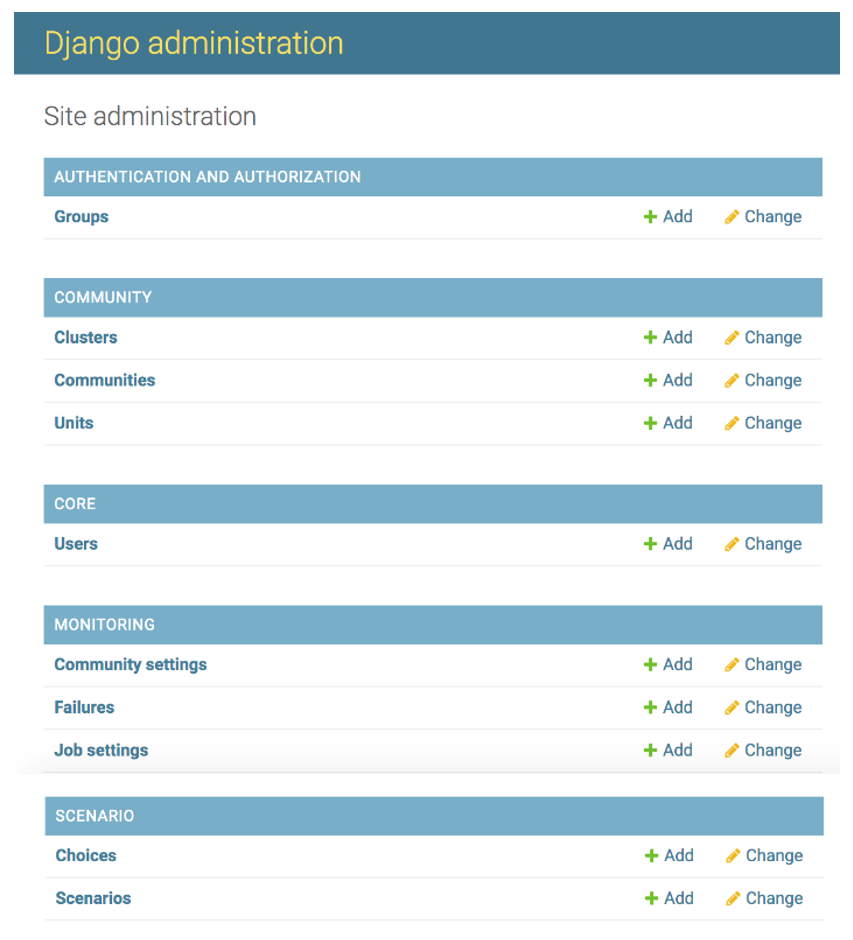  
図6-1
 

“AUTHENTIFICATION AND AUTHORIZATION” の “Groups”はDjangoのDefault設定で各Dataに対してアクセス制限を設定できるが、本Service Centerではこの機能の利用を想定していない。  
新規のCommunityを登録するために“COMMUNNITY” の”Communities”を選択すると以下画面が表示される。それぞれ適切に入力する。  
Code : apis-mainのconfig.jsonの”communityId” と同じを入力する。  
Name : 自由に入力する。

  
図6-2  
 

新規のClusterを登録するために“COMMUNNITY” の”Clusters”を選択すると以下画面が表示される。それぞれ適切に入力する。  
&emsp;Community : “Communities”で作成したCommunity の“Name”を選択する。  
&emsp;Code : apis-mainのconfig.jsonの”clusterId” と同じを入力する。  
&emsp;Name : 自由に入力する。

  
図6-3  
 

新規のUnitを登録するために“COMMUNNITY” の”Units”を選択すると以下画面が表示される。それぞれ適切に入力する。  
&emsp;Cluster : “Clusters”で作成したClusterの”Name”を選択する。  
&emsp;Code : apis-mainのconfig.jsonの”unitId” と同じに設定する。  
&emsp;Name : 自由に決める。  
&emsp;Available from : Unitの利用開始日を入力する。未記入可。  
&emsp;&emsp;&emsp;&emsp;&emsp;&emsp;&emsp;&emsp;&emsp;(downtime等の情報に関連する。)  
&emsp;Available to: Unitの利用終了日を入力する。未記入可。  
&emsp;&emsp;&emsp;&emsp;&emsp;&emsp;&emsp;&emsp;&emsp;(downtime等の情報に関連する。)  
&emsp;Users : Unitと紐づけるUserを選択する。未記入可。  
&emsp;&emsp;&emsp;&emsp;&emsp;&emsp;&emsp;&emsp;&emsp;(Userの登録は以下で説明。)  

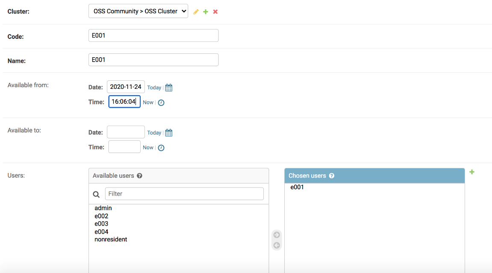  
図6-4
 

新規の管理者やユーザを登録するために“CORE” の”Users”を選択すると以下画面が表示される。それぞれ適切に入力する。  
&emsp;Username : 自由に入力する。  
&emsp;Password : 自由に入力する。

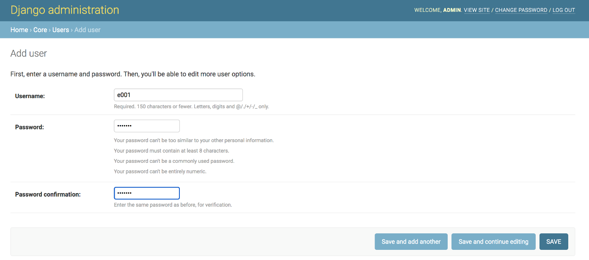  
図6-5
 

その後”SAVE” ボタンを押下すると以下の画面が表示される。  
登録アカウントが管理者の場合は “Staff status”　にチェックを入れる。  

  
図6-6
 

新規でCommunity内で障害が発生した場合のメールの通知先を登録する場合は　”MONITORING” の “Community Setting”を選択すると以下の画面が表示される。  
&emsp;Community Id : “Communities”で作成したCommunity の”Code”を選択する。  
&emsp;Notify to : 障害が発生した際のメールの通知先を入力する。

  
図6-7
 

障害一覧を参照したい場合は”MONITORING” の “Failures”を選択すると以下の画面が表示される。全Community, 全Clusterの障害情報を一括で表示可能である。膨大な量になる恐れがあるため以下のようにFilter機能がある。

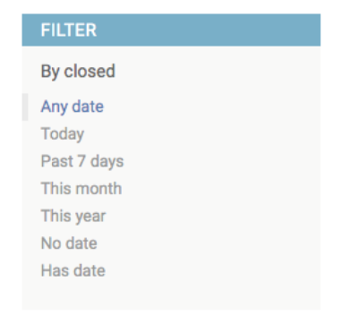  
図6-8
 

障害一覧を参照したい場合は”MONITORING” の “Job settings”を選択すると以下の画面が表示される。  
こちらは登録されている死活監視や障害検知などのJob機能のON/OFFを設定する。  
以下でアクセスできるON/OFF機能と同等である。  
http://127.0.0.1:8000/static/ui\_example/staff/monitoring.html

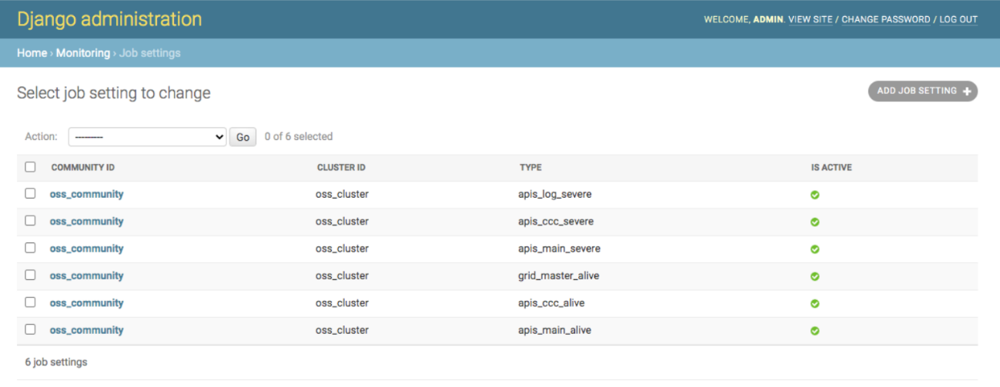  
図6-9
 

Unit毎にScenarioを選択する場合は ”SCENARIO”の “Choices ”を選択すると以下の画面が表示される。  
&emsp;Community Id : “Communities”で作成したCommunityの”Code”を入力する。  
&emsp;Cluster Id : “Clusters”で作成した Clusterの“Code”を入力する。  
&emsp;Unit Id: “Communities”で作成したUnitの”Code”を入力する。  
&emsp;Created : 作成日時を入力する。  
&emsp;Scenario : 登録されているScenarioを選択する。  

  
図6-10
 

新規でScenarioを登録する場合は “SCENARIO”の “Scenarios”を選択すると以下の画面が表示される。

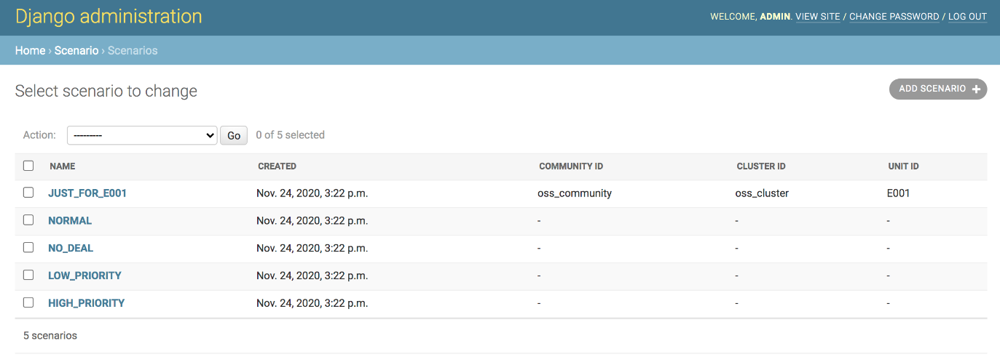  
図6-11
 

“ADD SCENARIO”ボタンを押下すると以下の画面が表示される。  
&emsp;Community Id : “Communities”で作成したCommunityの”Code”を選択する。(※1)  
&emsp;Cluster Id : “Clusters”で作成した Clusterの“Code”を選択する。(※1)  
&emsp;Unit Id: “Communities”で作成したUnitの”Code”を選択する。(※1)  
&emsp;Created : 作成日時を入力する。  
&emsp;Name : Scenarioの名前を入力する。  
&emsp;Description : Scenarioの説明を入力する。  
&emsp;Data : ScenarioをJSON形式で入力する。  
&emsp;&emsp;&emsp;&emsp;&emsp;&emsp;(Scenarioの作成方法はサンプルやapis-main仕様書を参照のこと)  

 

(※1)指定しなければ、全てのユニットが利用可能。  
&emsp;communityId のみを指定すれば、該当Community下の全Unitが利用可能。  
&emsp;communityId と clusterId を指定すれば、該当Cluster下の全Unitが利用可能。  
&emsp;communityId と clusterId と unitId を指定すれば、該当Unitのみ利用可能。

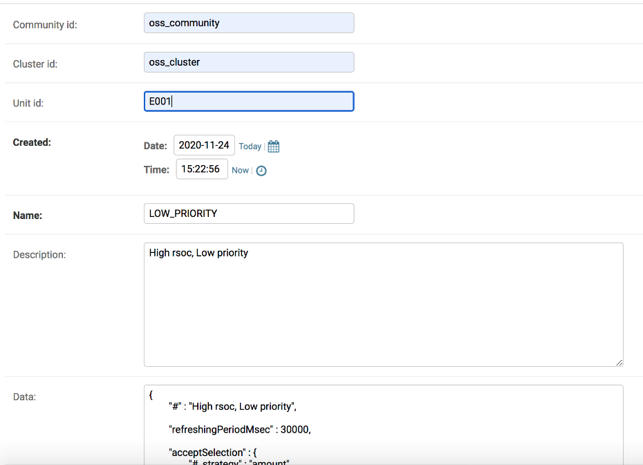  
図6-12
 

 

# **7. 通信仕様**
    
## **7.1. Service Center Web API**

下記のWeb APIにてService Centerと情報のやり取りを行うことができる。以下にそのWeb APIの仕様を説明する。(Web ServerのリバースプロキシのPathを “ / ” として記述)  
githubのサンプルはhttp://127.0.0.1:8000/の後にWeb APIのURLを追加すれアクセス可能である。  
以下のWeb APIのみPOSTアクセスで、それ以外はGETアクセスである。POSTアクセスはcurlによるアクセス例を記載、GETアクセスはWebブラウザ上でのアクセス例を記載している。  
(GETをWebブラウザアクセスではなく、curlでアクセスする場合は -H ‘Cookie:　sessionid=xxxxxx’が必要になる。)  

 

&emsp;/api/core/login  
&emsp;/api/misc/scenario/currentData  
&emsp;/api/misc/scenario/update

 

<table>
<tbody>
<tr class="odd">
<td>/api/core/login</td>
<td>
管理者及びユーザのログイン処理を行う。

&lt;アクセス例&gt;

(POSTなのでTerminal等で打つ場合を想定)

一旦以下でアクセスをした上で

Cookieのcsrftokenとcsrminddleを取得し

 curl -i '<a href="http://localhost:8000/api/core/csrftoken">http://localhost:8000/api/core/csrftoken</a>' 

その後

curl -i 'http://localhost:8000/api/core/login' -H 'Cookie: csrftoken=xxxxxx' -F 'username=oes' -F 'password=oes' -F 'csrfmiddlewaretoken=xxxxxxxx'

を実行する。
</td>
</tr>
<tr class="even">
<td>/api/core/logout</td>
<td>
管理者及びユーザのログアウト処理を行う。

(一旦ログインしてsession IDが渡っていないとログアウトはできない。)

&lt;アクセス例&gt;

http://127.0.0.1:8000/api/core/logout

&lt;リターン例&gt;

　無
</td>
</tr>
<tr class="odd">
<td>/api/core/session</td>
<td>
Service CenterとのWebのsession処理を行う。

&lt;アクセス例&gt;

githubのサンプルは以下でアクセス可能。

http://127.0.0.1:8000/api/core/session

&lt;リターン例&gt;

{

&quot;sessionid&quot;: &quot;gs0vyzrs6puevlus2kw072t0y3vdnjwf&quot;,

&quot;expiry_age&quot;: 1209600,

&quot;expiry_date&quot;: &quot;2020-12-07T13:42:42.274Z&quot;,

&quot;user&quot;: {

&quot;username&quot;: &quot;admin&quot;,

&quot;last_name&quot;: &quot;&quot;,

&quot;first_name&quot;: &quot;&quot;,

&quot;email&quot;: &quot;&quot;

}

}
</td>
</tr>
<tr class="even">
<td>/api/core/csrftoken</td>
<td>
CSRF対策のためのToken処理を行う。

&lt;アクセス例&gt;

githubのサンプルは以下でアクセス可能。

http://127.0.0.1:8000/api/core/csrftoken

&lt;リターン例&gt;

{

&quot;csrfmiddlewaretoken&quot;: &quot;xxxxxxxxxxxxxxxxxxxx&quot;

}
</td>
</tr>
<tr class="odd">
<td>/api/staff/client.js</td>
<td>
管理者のブラウザ上にDownloadされ

Service Centerの各アプリケーションとのインターフェースとなるJavaScriptである。

&lt;アクセス例&gt;

githubのサンプルは以下でアクセス可能。

http://127.0.0.1:8000/api/staff/client.js

&lt;リターン例&gt;

/api/staff/client.js 参照
</td>
</tr>
<tr class="even">
<td>/api/staff/community/outline</td>
<td>
[管理者用Web API]

MongoDBから、指定した日時でCommunity, Cluster, Unitの階層構造を取得しJSON形式で返す。

&lt;アクセス例&gt;

githubのサンプルは以下でアクセス可能。

http://127.0.0.1:8000/api/staff/community

/outline

&lt;リターン例&gt;

{

&quot;communities&quot;: {

&quot;oss_community&quot;: {

&quot;id&quot;: &quot;oss_community&quot;,

&quot;name&quot;: &quot;OSS Community&quot;,

&quot;clusters&quot;: {

&quot;oss_cluster&quot;: {

&quot;communityId&quot;: &quot;oss_community&quot;,

&quot;id&quot;: &quot;oss_cluster&quot;,

&quot;name&quot;: &quot;OSS Cluster&quot;,

&quot;units&quot;: {

&quot;E001&quot;: {

&quot;communityId&quot;: &quot;oss_community&quot;,

&quot;clusterId&quot;: &quot;oss_cluster&quot;,

&quot;id&quot;: &quot;E001&quot;,

&quot;name&quot;: &quot;E001&quot;,

&quot;available_from&quot;: null,

&quot;available_to&quot;: null

},

&quot;E002&quot;: {

&quot;communityId&quot;: &quot;oss_community&quot;,

&quot;clusterId&quot;: &quot;oss_cluster&quot;,

&quot;id&quot;: &quot;E002&quot;,

&quot;name&quot;: &quot;E002&quot;,

&quot;available_from&quot;: null,

&quot;available_to&quot;: null

},

}

}

}

}

}
</td>
</tr>
<tr class="odd">
<td>/api/staff/unitData/unitIdList</td>
<td>
[管理者用Web API]

Community ID及びCluster IDで指定したUnit Dataの ID Listを JSON 形式で返す。

&lt;アクセス例&gt;

githubのサンプルは以下でアクセス可能。

http://127.0.0.1:8000/api/staff/unitData/unitIdList

?communityId=oss_community

&amp;clusterId=oss_cluster

&lt;リターン例&gt;

[

&quot;E001&quot;,

&quot;E002&quot;

]
</td>
</tr>
<tr class="even">
<td>/api/staff/unitData/latestSet</td>
<td>
[管理者用Web API]

Community ID及びCluster IDで指定したUnit Dataの ID Listを JSON 形式で返す。

&lt;アクセス例&gt;

githubのサンプルは以下でアクセス可能。

http://127.0.0.1:8000/api/staff/unitData/latestSet

?communityId=oss_community

&amp;clusterId=oss_cluster

&lt;リターン例&gt;

{

&quot;E001&quot;: {

&quot;emu&quot;: {

&quot;charge_discharge_power&quot;: 299.2,

&quot;system_time&quot;: {

&quot;month&quot;: 12,

&quot;minute&quot;: 5,

&quot;day&quot;: 20,

&quot;hour&quot;: 23,

&quot;year&quot;: 2014

},

&quot;pvc_charge_current&quot;: 0,

&quot;ups_input_voltage&quot;: 102.8,

&quot;rsoc&quot;: 46.56,

&quot;battery_current&quot;: -6.23,

&quot;battery_voltage&quot;: 52.1,

&quot;pvc_charge_voltage&quot;: 0.28,

&quot;ups_operation_mode&quot;: {

&quot;parameter&quot;: 80,

&quot;mode&quot;: 2,

&quot;stop_mode&quot;: 2

},

&quot;ups_operation_schedule&quot;: 1,

&quot;ups_output_power&quot;: 130.0,

&quot;battery_rsoc&quot;: 34,

&quot;ups_output_frequency&quot;: 60,

&quot;pvc_charge_power&quot;: 0.0,

&quot;ups_output_current&quot;: 11.7,

&quot;dischargeable_time&quot;: {

&quot;minute&quot;: 0,

&quot;hour&quot;: 0

},

&quot;ups_output_voltage&quot;: 102.8

},

&quot;dcdc&quot;: {

&quot;status&quot;: {

&quot;status&quot;: &quot;0x0000&quot;,

&quot;alarmState&quot;: &quot;Light alarm&quot;,

&quot;operationMode&quot;: &quot;Waiting&quot;

},

&quot;meter&quot;: {

&quot;wg&quot;: 0,

&quot;tmp&quot;: 26.59,

&quot;vb&quot;: 48,

&quot;wb&quot;: -4.5,

&quot;vg&quot;: 0,

&quot;ib&quot;: -0.09,

&quot;ig&quot;: 0

},

&quot;vdis&quot;: {

&quot;dvg&quot;: 350.0,

&quot;drg&quot;: 0.0

},

&quot;param&quot;: {

&quot;dig&quot;: 0.0

}

},

&quot;oesunit&quot;: {

&quot;communityId&quot;: &quot;oss_community&quot;,

&quot;clusterId&quot;: &quot;oss_cluster&quot;,

&quot;id&quot;: &quot;E001&quot;,

&quot;display&quot;: &quot;E001&quot;,

&quot;sn&quot;: &quot;1&quot;,

&quot;budo&quot;: &quot;1&quot;,

&quot;ip&quot;: &quot;169.254.209.84&quot;,

&quot;ipv6_ll&quot;: &quot;NA&quot;,

&quot;ipv6_g&quot;: &quot;NA&quot;,

&quot;mac&quot;: &quot;8c:85:90:b2:14:ef&quot;

},

&quot;time&quot;: &quot;2019-12-31T20:36:10Z&quot;,

&quot;battery&quot;: {

&quot;rsoc&quot;: 46.56,

&quot;battery_operation_status&quot;: null

},

&quot;apis&quot;: {

&quot;version&quot;: &quot;3.0.0&quot;,

&quot;remaining_capacity_wh&quot;: 2234,

&quot;deal_interlock_capacity&quot;: 2,

&quot;is_grid_master&quot;: true,

&quot;operation_mode&quot;: {

&quot;global&quot;: &quot;autonomous&quot;,

&quot;local&quot;: null,

&quot;effective&quot;: &quot;autonomous&quot;

}

},

&quot;datasetId&quot;: 1606189298143

},

}
</td>
</tr>
<tr class="odd">
<td>/api/staff/deal/liveList</td>
<td>
[管理者用Web API]

Community ID及び Cluster IDで指定した

Cluster内で現在実行されている電力融通情報を

ListしJSON形式で返す。

&lt;アクセス例&gt;

githubのサンプルは以下でアクセス可能

http://127.0.0.1:8000/api/staff/deal/liveList

?communityId=oss_community

&amp;clusterId=oss_cluster

&lt;リターン例&gt;

[

{

&quot;unitId&quot;: &quot;E003&quot;,

&quot;negotiationId&quot;: &quot;d2db0d7a-5836-4a13-90bf-416ab4654a2c&quot;,

&quot;requestUnitId&quot;: &quot;E003&quot;,

&quot;acceptUnitId&quot;: &quot;E001&quot;,

&quot;requestDateTime&quot;: &quot;2020-01-01T06:05:40Z&quot;,

&quot;acceptDateTime&quot;: &quot;2020-01-01T06:05:40Z&quot;,

&quot;requestPointPerWh&quot;: 10.0,

&quot;acceptPointPerWh&quot;: 10.0,

&quot;requestDealGridCurrentA&quot;: 1.0,

&quot;acceptDealGridCurrentA&quot;: 1.0,

&quot;type&quot;: &quot;charge&quot;,

&quot;chargeUnitId&quot;: &quot;E003&quot;,

&quot;dischargeUnitId&quot;: &quot;E001&quot;,

&quot;pointPerWh&quot;: 10.0,

&quot;chargeUnitEfficientGridVoltageV&quot;: 312.0,

&quot;dischargeUnitEfficientGridVoltageV&quot;: 312.0,

&quot;dealGridCurrentA&quot;: 1.0,

&quot;requestAmountWh&quot;: 1358,

&quot;acceptAmountWh&quot;: 536,

&quot;dealAmountWh&quot;: 50,

&quot;dealId&quot;: &quot;f6f9743d-d6f0-4611-a5c9-b166c43acf95&quot;,

&quot;createDateTime&quot;: &quot;2020-01-01T06:05:40Z&quot;,

&quot;compensationTargetVoltageReferenceGridCurrentA&quot;: -2.0,

&quot;activateDateTime&quot;: &quot;2020-01-01T06:09:10Z&quot;,

&quot;warmUpDateTime&quot;: &quot;2020-01-01T06:09:10Z&quot;,

&quot;dischargeUnitCompensatedGridCurrentA&quot;: -1.0,

&quot;chargeUnitCompensatedGridCurrentA&quot;: 1.0,

&quot;startDateTime&quot;: &quot;2020-01-01T06:09:10Z&quot;,

&quot;cumulateDateTime&quot;: &quot;2020-01-01T06:10:50Z&quot;,

&quot;cumulateAmountWh&quot;: 7.1944447,

&quot;communityId&quot;: &quot;oss_community&quot;,

&quot;clusterId&quot;: &quot;oss_cluster&quot;,

&quot;reportTime&quot;: 1606138146

}

]
</td>
</tr>
<tr class="even">
<td>/api/staff/deal/list</td>
<td>
[管理者用Web API]

Community ID及び Cluster IDで指定したCluster内で実行された電力融通情報をListしJSON形式で返す。(datetimeFrom, datatimeToで期間も絞れる。)

&lt;アクセス例&gt;

githubのサンプルは以下でアクセス可能

http://127.0.0.1:8000/api/staff/deal/list

?communityId=oss_community

&amp;clusterId=oss_cluster

&lt;リターン例&gt;

[

{

&quot;unitId&quot;: &quot;E004&quot;,

&quot;negotiationId&quot;: &quot;592f2616-4c5e-4c40-a364-589b9c054221&quot;,

&quot;requestUnitId&quot;: &quot;E004&quot;,

&quot;acceptUnitId&quot;: &quot;E001&quot;,

&quot;requestDateTime&quot;: &quot;2019-12-31T15:19:10Z&quot;,

&quot;acceptDateTime&quot;: &quot;2019-12-31T15:18:30Z&quot;,

&quot;requestPointPerWh&quot;: 10.0,

&quot;acceptPointPerWh&quot;: 10.0,

&quot;requestDealGridCurrentA&quot;: 1.0,

&quot;acceptDealGridCurrentA&quot;: 1.0,

&quot;type&quot;: &quot;charge&quot;,

&quot;chargeUnitId&quot;: &quot;E004&quot;,

&quot;dischargeUnitId&quot;: &quot;E001&quot;,

&quot;pointPerWh&quot;: 10.0,

&quot;chargeUnitEfficientGridVoltageV&quot;: 312.0,

&quot;dischargeUnitEfficientGridVoltageV&quot;: 312.0,

&quot;dealGridCurrentA&quot;: 1.0,

&quot;requestAmountWh&quot;: 646,

&quot;acceptAmountWh&quot;: 716,

&quot;dealAmountWh&quot;: 50,

&quot;dealId&quot;: &quot;95bafe56-76b7-403f-8e6d-7f6e9af55d21&quot;,

&quot;createDateTime&quot;: &quot;2019-12-31T15:19:10Z&quot;,

&quot;compensationTargetVoltageReferenceGridCurrentA&quot;: -2.0,

&quot;activateDateTime&quot;: &quot;2019-12-31T15:22:50Z&quot;,

&quot;warmUpDateTime&quot;: &quot;2019-12-31T15:22:50Z&quot;,

&quot;dischargeUnitCompensatedGridCurrentA&quot;: -1.0,

&quot;chargeUnitCompensatedGridCurrentA&quot;: 1.0,

&quot;startDateTime&quot;: &quot;2019-12-31T15:22:50Z&quot;,

&quot;cumulateDateTime&quot;: &quot;2019-12-31T15:34:30Z&quot;,

&quot;cumulateAmountWh&quot;: 50.361103,

&quot;stopDateTime&quot;: &quot;2019-12-31T15:34:30Z&quot;,

&quot;deactivateDateTime&quot;: &quot;2019-12-31T15:34:30Z&quot;,

&quot;communityId&quot;: &quot;oss_community&quot;,

&quot;clusterId&quot;: &quot;oss_cluster&quot;,

&quot;reportTime&quot;: 1606056822

}

]
</td>
</tr>
<tr class="odd">
<td>/api/staff/deal/datetimeRange</td>
<td>
[管理者用Web API]

Community ID及び Cluster IDで指定したCluster内で実行された電力融通の作成日時の期間をListしJSON形式で返す。

&lt;アクセス例&gt;

githubのサンプルは以下でアクセス可能

http://127.0.0.1:8000/api/staff/deal/datetimeRange

?communityId=oss_community

&amp;clusterId=oss_cluster

&lt;リターン例&gt;

{

&quot;min&quot;: &quot;2019-12-31T15:19:10Z&quot;,

&quot;max&quot;: &quot;2020-01-09T09:08:10Z&quot;

}
</td>
</tr>
<tr class="even">
<td>
/api/staff/deal/

sumOfCumulateAmountWhsByHour
</td>
<td>
[管理者用Web API]

Community ID及び Cluster IDで指定したCluster内で実行された電力融通の時間別融通電力量の集計結果をListしJSON形式で返す。

&lt;アクセス例&gt;

githubのサンプルは以下でアクセス可能

http://127.0.0.1:8000/api/staff/deal

/sumOfCumulateAmountWhsByHour

?communityId=oss_community

&amp;clusterId=oss_cluster&amp;timezone=%2B09%3A00

&lt;リターン例&gt;

{

&quot;0&quot;: 306.48328000000004,

&quot;1&quot;: 107.983345,

&quot;6&quot;: 215.96669,

&quot;7&quot;: 107.983345,

&quot;9&quot;: 316.74445000000003,

&quot;10&quot;: 1427.327889,

&quot;11&quot;: 414.934751,

&quot;12&quot;: 8.180555,

&quot;15&quot;: 107.49028799999999,

&quot;16&quot;: 315.454191,

&quot;17&quot;: 1481.980689,

&quot;18&quot;: 1947.715443,

&quot;19&quot;: 1184.748663

}
</td>
</tr>
<tr class="odd">
<td>/api/staff/downtime/unitIdList</td>
<td>
[管理者用Web API]

Community ID及び Cluster IDと期間で指定したCluster内で処理状態を持つUnitのID　listをJSON形式で返す。

&lt;アクセス例&gt;

githubのサンプルは以下でアクセス可能

http://127.0.0.1:8000/api/staff/downtime

/unitIdList?communityId=oss_community

&amp;clusterId=oss_cluster&amp;datetimeFrom

=2020-01-01T15%3A00%3A00.000Z

&amp;datetimeTo=2020-01-02T15%3A00%3A00.000Z

&lt;リターン例&gt;

[

&quot;E001&quot;,

&quot;E002&quot;,

&quot;E003&quot;,

&quot;E004&quot;

]
</td>
</tr>
<tr class="even">
<td>/api/staff/downtime/list</td>
<td>
[管理者用Web API]

Community ID、Cluster IDと期間で指定したdowntimeのlistをJSON形式で返す。

&lt;アクセス例&gt;

githubのサンプルは以下でアクセス可能

http://127.0.0.1:8000/api/staff/downtime

/list?communityId=oss_community

&amp;clusterId=oss_cluster&amp;datetimeFrom

=2020-01-01T15%3A00%3A00.000Z

&amp;datetimeTo=2020-01-02T15%3A00%3A00.000Z

&lt;リターン例&gt;

[

{

&quot;clusterId&quot;: &quot;oss_cluster&quot;,

&quot;communityId&quot;: &quot;oss_community&quot;,

&quot;recoveryDateTime&quot;: &quot;2019-12-31T15:12:20Z&quot;,

&quot;unitId&quot;: &quot;E001&quot;,

&quot;downDateTime&quot;: &quot;2019-12-31T15:07:20Z&quot;

},

{

&quot;clusterId&quot;: &quot;oss_cluster&quot;,

&quot;communityId&quot;: &quot;oss_community&quot;,

&quot;recoveryDateTime&quot;: &quot;2019-12-31T15:12:20Z&quot;,

&quot;unitId&quot;: &quot;E004&quot;,

&quot;downDateTime&quot;: &quot;2019-12-31T15:07:20Z&quot;

}

]

</td>
</tr>
<tr class="odd">
<td>/api/staff/monitoring/failure/openList</td>
<td>
[管理者用Web API]

Community ID及び Cluster IDで指定したCluster内でOpenな障害情報をlistしJSON形式で返す。

&lt;アクセス例&gt;

githubのサンプルは以下でアクセス可能

http://127.0.0.1:8000/api/staff/monitoring

/failure/openList?communityId=oss_community

&amp;clusterId=oss_cluster

&lt;リターン例&gt;

[

{

&quot;id&quot;: 53,

&quot;type&quot;: &quot;apis_ccc_alive&quot;,

&quot;community_id&quot;: &quot;oss_community&quot;,

&quot;cluster_id&quot;: &quot;oss_cluster&quot;,

&quot;program_id&quot;: &quot;apis-ccc&quot;,

&quot;unit_id&quot;: null,

&quot;detected&quot;: &quot;2020-11-24T03:27:51.696Z&quot;,

&quot;closed&quot;: null,

&quot;description&quot;: &quot;The program may not be running.&quot;

}

]
</td>
</tr>
<tr class="even">
<td>/api/staff/monitoring/failure/list</td>
<td>
[管理者用Web API]

Community ID、Cluster IDで指定した全ての障害情報のlistをJSON形式で返す。

(datetimeFrom, datatimeToで期間も絞れる。)

&lt;アクセス例&gt;

githubのサンプルは以下でアクセス可能

http://127.0.0.1:8000/api/staff/monitoring

/failure/list?communityId=oss_community

&amp;clusterId=oss_cluster

&lt;リターン例&gt;

[

{

&quot;id&quot;: 6,

&quot;type&quot;: &quot;apis_ccc_alive&quot;,

&quot;community_id&quot;: &quot;oss_community&quot;,

&quot;cluster_id&quot;: &quot;oss_cluster&quot;,

&quot;program_id&quot;: &quot;apis-ccc&quot;,

&quot;unit_id&quot;: null,

&quot;detected&quot;: &quot;2020-11-23T15:42:17.781Z&quot;,

&quot;closed&quot;: &quot;2020-11-24T03:08:09.412Z&quot;,

&quot;description&quot;: &quot;The program may not be running.&quot;

}

]
</td>
</tr>
<tr class="odd">
<td>/api/staff/monitoring/job/list</td>
<td>
[管理者用Web API]

Community ID及び Cluster IDで指定したCluster内のjobのActive/DeactiveのlistをJSON形式で返す。

&lt;アクセス例&gt;

githubのサンプルは以下でアクセス可能

http://127.0.0.1:8000/api/staff/monitoring

/job/list?communityId=oss_community

&amp;clusterId=oss_cluster

&lt;リターン例&gt;

[

{

&quot;type&quot;: &quot;apis_main_alive&quot;,

&quot;isActive&quot;: true

},

{

&quot;type&quot;: &quot;apis_ccc_alive&quot;,

&quot;isActive&quot;: false

},

{

&quot;type&quot;: &quot;apis_ccc_severe&quot;,

&quot;isActive&quot;: true

},

{

&quot;type&quot;: &quot;apis_log_severe&quot;,

&quot;isActive&quot;: false

}

]
</td>
</tr>
<tr class="even">
<td>/api/staff/monitoring/job/activate</td>
<td>
[管理者用Web API]

Community ID及び Cluster IDで指定したCluster内のjobをActiveに設定する。

&lt;アクセス例&gt;

githubのサンプルは以下でアクセス可能

http://127.0.0.1:8000/api/staff/monitoring

/job/activate?communityId=oss_community

&amp;clusterId=oss_cluster&amp;type=apis_ccc_severe

&lt;リターン例&gt;

OK
</td>
</tr>
<tr class="odd">
<td>/api/staff/monitoring/job/deactivate</td>
<td>
[管理者用Web API]

Community ID及び Cluster IDで指定したCluster内のjobをDeactiveに設定する。

&lt;例&gt;

githubのサンプルは以下でアクセス可能

http://127.0.0.1:8000/api/staff/monitoring

/job/deactivate?communityId=oss_community

&amp;clusterId=oss_cluster&amp;type=apis_ccc_severe

&lt;リターン例&gt;

OK
</td>
</tr>
<tr class="even">
<td>/api/resident/client.js</td>
<td>
[ユーザ用Web API]

ユーザのブラウザ上にDownloadされ

Service Centerの各アプリケーションとのインターフェースとなるJavaScriptである。

&lt;アクセス例&gt;

githubのサンプルは以下でアクセス可能。

http://127.0.0.1:8000/api/resident/client.js

&lt;リターン例&gt;

/api/resident/client.js 参照
</td>
</tr>
<tr class="odd">
<td>/api/resident/community/outline</td>
<td>
[ユーザ用Web API]

MongoDBから参照可能なUnitに対するCommunityとClusterのツリー構造をJSON形式で返す。

&lt;アクセス例&gt;

githubのサンプルは以下でアクセス可能。

http://127.0.0.1:8000/api/resident/community

/outline

&lt;リターン例&gt;

{

&quot;communities&quot;: {

&quot;oss_community&quot;: {

&quot;id&quot;: &quot;oss_community&quot;,

&quot;name&quot;: &quot;OSS Community&quot;,

&quot;clusters&quot;: {

&quot;oss_cluster&quot;: {

&quot;communityId&quot;: &quot;oss_community&quot;,

&quot;id&quot;: &quot;oss_cluster&quot;,

&quot;name&quot;: &quot;OSS Cluster&quot;,

&quot;units&quot;: {

&quot;E001&quot;: {

&quot;communityId&quot;: &quot;oss_community&quot;,

&quot;clusterId&quot;: &quot;oss_cluster&quot;,

&quot;id&quot;: &quot;E001&quot;,

&quot;name&quot;: &quot;E001&quot;,

&quot;available_from&quot;: null,

&quot;available_to&quot;: null

}

}

}
</td>
</tr>
<tr class="even">
<td>/api/resident/unitData/latestSet</td>
<td>
[ユーザ用Web API]

指定したUnitのUnit Dataの最新の一式を JSON形式で返す。

&lt;アクセス例&gt;

githubのサンプルは以下でアクセス可能

http://127.0.0.1:8000/api/resident/unitData

/latestSet?communityId=oss_community

&amp;clusterId=oss_cluster&amp;unitId=E001

&lt;リターン例&gt;

{

&quot;E001&quot;: {

&quot;emu&quot;: {

&quot;charge_discharge_power&quot;: 22.8,

&quot;system_time&quot;: {

&quot;month&quot;: 12,

&quot;minute&quot;: 5,

&quot;day&quot;: 20,

&quot;hour&quot;: 23,

&quot;year&quot;: 2014

},

&quot;pvc_charge_current&quot;: 0,

&quot;ups_input_voltage&quot;: 102.8,

&quot;rsoc&quot;: 29.99,

&quot;battery_current&quot;: -0.48,

&quot;battery_voltage&quot;: 52.1,

&quot;pvc_charge_voltage&quot;: 0.28,

&quot;ups_operation_mode&quot;: {

&quot;parameter&quot;: 80,

&quot;mode&quot;: 5,

&quot;stop_mode&quot;: 2

},

&quot;ups_operation_schedule&quot;: 1,

&quot;ups_output_power&quot;: 130.0,

&quot;battery_rsoc&quot;: 34,

&quot;ups_output_frequency&quot;: 60,

&quot;pvc_charge_power&quot;: 0.0,

&quot;ups_output_current&quot;: 11.7,

&quot;dischargeable_time&quot;: {

&quot;minute&quot;: 0,

&quot;hour&quot;: 0

},

&quot;ups_output_voltage&quot;: 102.8

},

&quot;dcdc&quot;: {

&quot;status&quot;: {

&quot;status&quot;: &quot;0x0000&quot;,

&quot;alarmState&quot;: &quot;Light alarm&quot;,

&quot;operationMode&quot;: &quot;Waiting&quot;

},

&quot;meter&quot;: {

&quot;wg&quot;: 0,

&quot;tmp&quot;: 26.59,

&quot;vb&quot;: 48,

&quot;wb&quot;: -4.5,

&quot;vg&quot;: 0,

&quot;ib&quot;: -0.09,

&quot;ig&quot;: 0

},

&quot;vdis&quot;: {

&quot;dvg&quot;: 350.0,

&quot;drg&quot;: 0.0

},

&quot;param&quot;: {

&quot;dig&quot;: 0.0

}

},

&quot;oesunit&quot;: {

&quot;communityId&quot;: &quot;oss_community&quot;,

&quot;clusterId&quot;: &quot;oss_cluster&quot;,

&quot;id&quot;: &quot;E001&quot;,

&quot;display&quot;: &quot;E001&quot;,

&quot;sn&quot;: &quot;1&quot;,

&quot;budo&quot;: &quot;1&quot;,

&quot;ip&quot;: &quot;192.168.3.36&quot;,

&quot;ipv6_ll&quot;: &quot;NA&quot;,

&quot;ipv6_g&quot;: &quot;NA&quot;,

&quot;mac&quot;: &quot;f0:23:b9:60:09:21&quot;

},

&quot;time&quot;: &quot;2020-01-01T15:37:40Z&quot;,

&quot;battery&quot;: {

&quot;rsoc&quot;: 29.99,

&quot;battery_operation_status&quot;: null

},

&quot;apis&quot;: {

&quot;version&quot;: &quot;3.0.0&quot;,

&quot;remaining_capacity_wh&quot;: 1439,

&quot;deal_interlock_capacity&quot;: 2,

&quot;is_grid_master&quot;: true,

&quot;operation_mode&quot;: {

&quot;global&quot;: &quot;autonomous&quot;,

&quot;local&quot;: null,

&quot;effective&quot;: &quot;autonomous&quot;

}

},

&quot;datasetId&quot;: 1606141567737

}

}
</td>
</tr>
<tr class="odd">
<td>/api/resident/deal/liveList</td>
<td>
[ユーザ用Web API]

Community ID、Cluster ID、Unit IDで指定されたUnitが現在実行している電力融通情報をListしJSON形式で返す。

&lt;アクセス例&gt;

githubのサンプルは以下でアクセス可能

http://127.0.0.1:8000/api/resident/unitData

/liveList?communityId=oss_community

&amp;clusterId=oss_cluster&amp;unitId=E001

&lt;リターン例&gt;

[

{

&quot;createDateTime&quot;: &quot;2020-01-01T17:23:10Z&quot;,

&quot;dealId&quot;: &quot;41044395-bde7-46e6-acce-0bbd447f3dbf&quot;,

&quot;dischargeUnitId&quot;: &quot;E001&quot;,

&quot;chargeUnitId&quot;: &quot;******&quot;,

&quot;type&quot;: &quot;charge&quot;,

&quot;requestUnitId&quot;: &quot;******&quot;,

&quot;requestAmountWh&quot;: 1420,

&quot;acceptUnitId&quot;: &quot;E001&quot;,

&quot;dealAmountWh&quot;: 50,

&quot;startDateTime&quot;: &quot;2020-01-01T17:26:40Z&quot;,

&quot;cumulateAmountWh&quot;: 7.1944447

},
</td>
</tr>
<tr class="even">
<td>/api/resident/deal/list</td>
<td>
[ユーザ用Web API]

Community ID、Cluster ID、Unit　IDで指定されたUnitの電力融通情報をListしJSON形式で返す。(datetimeFrom, datatimeToで期間も絞れる。)

&lt;アクセス例&gt;

githubのサンプルは以下でアクセス可能

http://127.0.0.1:8000/api/resident/unitData

/list?communityId=oss_community

&amp;clusterId=oss_cluster&amp;unitId=E001

&lt;リターン例&gt;

[

{

&quot;createDateTime&quot;: &quot;2019-12-31T15:19:10Z&quot;,

&quot;dealId&quot;: &quot;95bafe56-76b7-403f-8e6d-7f6e9af55d21&quot;,

&quot;dischargeUnitId&quot;: &quot;E001&quot;,

&quot;chargeUnitId&quot;: &quot;******&quot;,

&quot;type&quot;: &quot;charge&quot;,

&quot;requestUnitId&quot;: &quot;******&quot;,

&quot;requestAmountWh&quot;: 646,

&quot;acceptUnitId&quot;: &quot;E001&quot;,

&quot;dealAmountWh&quot;: 50,

&quot;startDateTime&quot;: &quot;2019-12-31T15:22:50Z&quot;,

&quot;cumulateAmountWh&quot;: 50.361103,

&quot;stopDateTime&quot;: &quot;2019-12-31T15:34:30Z&quot;,

&quot;deactivateDateTime&quot;: &quot;2019-12-31T15:34:30Z&quot;

}

]
</td>
</tr>
<tr class="odd">
<td>/api/resident/scenario/availableList</td>
<td>
[ユーザ用Web API]

Community ID、 Cluster ID、Unit IDで指定されたUnitが利用可能なScenarioをListしJSON形式で返す。

&lt;アクセス例&gt;

githubのサンプルは以下でアクセス可能

http://127.0.0.1:8000/api/resident/scenario

/availableList?communityId=oss_community

&amp;clusterId=oss_cluster&amp;unitId=E002

&lt;リターン例&gt;

[

{

&quot;id&quot;: 1,

&quot;community_id&quot;: null,

&quot;cluster_id&quot;: null,

&quot;unit_id&quot;: null,

&quot;created&quot;: &quot;2020-11-26T04:26:59.166Z&quot;,

&quot;name&quot;: &quot;HIGH_PRIORITY&quot;,

&quot;description&quot;: &quot;Low rsoc, High priority&quot;,

&quot;data&quot;: &quot;{ &emsp;\&quot;#\&quot; : \&quot;Low rsoc, High priority\&quot;,  &emsp;\&quot;refreshingPeriodMsec\&quot; : 30000,  &emsp;\&quot;acceptSelection\&quot; : { &emsp;&emsp;\&quot;#_strategy\&quot; : \&quot;amount\&quot;, &emsp;&emsp;\&quot;strategy\&quot; : \&quot;pointAndAmount\&quot;, &emsp;&emsp;\&quot;#\&quot; : \&quot;end\&quot; &emsp;},  &emsp;\&quot;00:00:00-24:00:00\&quot; : { &emsp;&emsp;\&quot;batteryStatus\&quot; : { &emsp;&emsp;&emsp;\&quot;4800-\&quot; : \&quot;excess\&quot;, &emsp;&emsp;&emsp;\&quot;4320-4800\&quot; : \&quot;sufficient\&quot;, &emsp;&emsp;&emsp;\&quot;3600-4320\&quot; : \&quot;scarce\&quot;, &emsp;&emsp;&emsp;\&quot;-3600\&quot; : \&quot;short\&quot; &emsp;&emsp;}, &emsp;&emsp;\&quot;request\&quot; : { &emsp;&emsp;&emsp;\&quot;excess\&quot; : { &emsp;&emsp;&emsp;&emsp;\&quot;discharge\&quot; : { &emsp;&emsp;&emsp;&emsp;&emsp;\&quot;limitWh\&quot; : 4800, &emsp;&emsp;&emsp;&emsp;&emsp;\&quot;pointPerWh\&quot; : 10 &emsp;&emsp;&emsp;&emsp;} &emsp;&emsp;&emsp;}, &emsp;&emsp;&emsp;\&quot;sufficient\&quot; : { &emsp;&emsp;&emsp;}, &emsp;&emsp;&emsp;\&quot;scarce\&quot; : { &emsp;&emsp;&emsp;}, &emsp;&emsp;&emsp;\&quot;short\&quot; : { &emsp;&emsp;&emsp;&emsp;\&quot;charge\&quot; : { &emsp;&emsp;&emsp;&emsp;&emsp;\&quot;limitWh\&quot; : 3600, &emsp;&emsp;&emsp;&emsp;&emsp;\&quot;pointPerWh\&quot; : 10 &emsp;&emsp;&emsp;&emsp;} &emsp;&emsp;&emsp;} &emsp;&emsp;}, &emsp;&emsp;\&quot;accept\&quot; : { &emsp;&emsp;&emsp;\&quot;excess\&quot; : { &emsp;&emsp;&emsp;&emsp;\&quot;discharge\&quot; : { &emsp;&emsp;&emsp;&emsp;&emsp;\&quot;limitWh\&quot; : 4320, &emsp;&emsp;&emsp;&emsp;&emsp;\&quot;pointPerWh\&quot; : 10 &emsp;&emsp;&emsp;&emsp;} &emsp;&emsp;&emsp;}, &emsp;&emsp;&emsp;\&quot;sufficient\&quot; : { &emsp;&emsp;&emsp;&emsp;\&quot;discharge\&quot; : { &emsp;&emsp;&emsp;&emsp;&emsp;\&quot;limitWh\&quot; : 4320, &emsp;&emsp;&emsp;&emsp;&emsp;\&quot;pointPerWh\&quot; : 10 &emsp;&emsp;&emsp;&emsp;} &emsp;&emsp;&emsp;}, &emsp;&emsp;&emsp;\&quot;scarce\&quot; : { &emsp;&emsp;&emsp;&emsp;\&quot;charge\&quot; : { &emsp;&emsp;&emsp;&emsp;&emsp;\&quot;limitWh\&quot; : 4320, &emsp;&emsp;&emsp;&emsp;&emsp;\&quot;pointPerWh\&quot; : 10 &emsp;&emsp;&emsp;&emsp;} &emsp;&emsp;&emsp;}, &emsp;&emsp;&emsp;\&quot;short\&quot; : { &emsp;&emsp;&emsp;&emsp;\&quot;charge\&quot; : { &emsp;&emsp;&emsp;&emsp;&emsp;\&quot;limitWh\&quot; : 4320, &emsp;&emsp;&emsp;&emsp;&emsp;\&quot;pointPerWh\&quot; : 10 &emsp;&emsp;&emsp;&emsp;} &emsp;&emsp;&emsp;} &emsp;&emsp;} &emsp;},  &emsp;\&quot;#\&quot; : \&quot;end\&quot; }&quot;

},

{

&quot;id&quot;: 2,

&quot;community_id&quot;: null,

&quot;cluster_id&quot;: null,

&quot;unit_id&quot;: null,

&quot;created&quot;: &quot;2020-11-26T04:26:59.167Z&quot;,

&quot;name&quot;: &quot;LOW_PRIORITY&quot;,

&quot;description&quot;: &quot;High rsoc, Low priority&quot;,

&quot;data&quot;: &quot;{ &emsp;\&quot;#\&quot; : \&quot;High rsoc, Low priority\&quot;,  &emsp;\&quot;refreshingPeriodMsec\&quot; : 30000,  &emsp;\&quot;acceptSelection\&quot; : { &emsp;&emsp;\&quot;#_strategy\&quot; : \&quot;amount\&quot;, &emsp;&emsp;\&quot;strategy\&quot; : \&quot;pointAndAmount\&quot;, &emsp;&emsp;\&quot;#\&quot; : \&quot;end\&quot; &emsp;},  &emsp;\&quot;00:00:00-24:00:00\&quot; : { &emsp;&emsp;\&quot;batteryStatus\&quot; : { &emsp;&emsp;&emsp;\&quot;3600-\&quot; : \&quot;excess\&quot;, &emsp;&emsp;&emsp;\&quot;2400-3600\&quot; : \&quot;sufficient\&quot;, &emsp;&emsp;&emsp;\&quot;0-2400\&quot; : \&quot;scarce\&quot;, &emsp;&emsp;&emsp;\&quot;-0\&quot; : \&quot;short\&quot; &emsp;&emsp;}, &emsp;&emsp;\&quot;request\&quot; : { &emsp;&emsp;&emsp;\&quot;excess\&quot; : { &emsp;&emsp;&emsp;&emsp;\&quot;discharge\&quot; : { &emsp;&emsp;&emsp;&emsp;&emsp;\&quot;limitWh\&quot; : 2400, &emsp;&emsp;&emsp;&emsp;&emsp;\&quot;pointPerWh\&quot; : 10 &emsp;&emsp;&emsp;&emsp;} &emsp;&emsp;&emsp;}, &emsp;&emsp;&emsp;\&quot;sufficient\&quot; : { &emsp;&emsp;&emsp;}, &emsp;&emsp;&emsp;\&quot;scarce\&quot; : { &emsp;&emsp;&emsp;}, &emsp;&emsp;&emsp;\&quot;short\&quot; : { &emsp;&emsp;&emsp;&emsp;\&quot;charge\&quot; : { &emsp;&emsp;&emsp;&emsp;&emsp;\&quot;limitWh\&quot; : 2400, &emsp;&emsp;&emsp;&emsp;&emsp;\&quot;pointPerWh\&quot; : 10 &emsp;&emsp;&emsp;&emsp;} &emsp;&emsp;&emsp;} &emsp;&emsp;}, &emsp;&emsp;\&quot;accept\&quot; : { &emsp;&emsp;&emsp;\&quot;excess\&quot; : { &emsp;&emsp;&emsp;&emsp;\&quot;discharge\&quot; : { &emsp;&emsp;&emsp;&emsp;&emsp;\&quot;limitWh\&quot; : 2400, &emsp;&emsp;&emsp;&emsp;&emsp;\&quot;pointPerWh\&quot; : 10 &emsp;&emsp;&emsp;&emsp;} &emsp;&emsp;&emsp;}, &emsp;&emsp;&emsp;\&quot;sufficient\&quot; : { &emsp;&emsp;&emsp;&emsp;\&quot;discharge\&quot; : { &emsp;&emsp;&emsp;&emsp;&emsp;\&quot;limitWh\&quot; : 2400, &emsp;&emsp;&emsp;&emsp;&emsp;\&quot;pointPerWh\&quot; : 10 &emsp;&emsp;&emsp;&emsp;} &emsp;&emsp;&emsp;}, &emsp;&emsp;&emsp;\&quot;scarce\&quot; : { &emsp;&emsp;&emsp;&emsp;\&quot;charge\&quot; : { &emsp;&emsp;&emsp;&emsp;&emsp;\&quot;limitWh\&quot; : 3600, &emsp;&emsp;&emsp;&emsp;&emsp;\&quot;pointPerWh\&quot; : 10 &emsp;&emsp;&emsp;&emsp;} &emsp;&emsp;&emsp;}, &emsp;&emsp;&emsp;\&quot;short\&quot; : { &emsp;&emsp;&emsp;&emsp;\&quot;charge\&quot; : { &emsp;&emsp;&emsp;&emsp;&emsp;\&quot;limitWh\&quot; : 3600, &emsp;&emsp;&emsp;&emsp;&emsp;\&quot;pointPerWh\&quot; : 10 &emsp;&emsp;&emsp;&emsp;} &emsp;&emsp;&emsp;} &emsp;&emsp;} &emsp;},  &emsp;\&quot;#\&quot; : \&quot;end\&quot; }&quot;

}

]
</td>
</tr>
<tr class="even">
<td>/api/resident/scenario/current</td>
<td>
[ユーザ用Web API]

Community ID、 Cluster ID、Unit IDで指定されたUnitが現在選択しているScenarioをListしJSON形式で返す。

&lt;アクセス例&gt;

githubのサンプルは以下でアクセス可能

http://127.0.0.1:8000/api/resident/scenario

/current?communityId=oss_community

&amp;clusterId=oss_cluster&amp;unitId=E002

&lt;リターン例&gt;

{

&quot;id&quot;: 1,

&quot;community_id&quot;: null,

&quot;cluster_id&quot;: null,

&quot;unit_id&quot;: null,

&quot;created&quot;: &quot;2020-11-26T04:26:59.166Z&quot;,

&quot;name&quot;: &quot;HIGH_PRIORITY&quot;,

&quot;description&quot;: &quot;Low rsoc, High priority&quot;,

&quot;data&quot;: &quot;{ &emsp;\&quot;#\&quot; : \&quot;Low rsoc, High priority\&quot;,  &emsp;\&quot;refreshingPeriodMsec\&quot; : 30000,  &emsp;\&quot;acceptSelection\&quot; : { &emsp;&emsp;\&quot;#_strategy\&quot; : \&quot;amount\&quot;, &emsp;&emsp;\&quot;strategy\&quot; : \&quot;pointAndAmount\&quot;, &emsp;&emsp;\&quot;#\&quot; : \&quot;end\&quot; &emsp;},  &emsp;\&quot;00:00:00-24:00:00\&quot; : { &emsp;&emsp;\&quot;batteryStatus\&quot; : { &emsp;&emsp;&emsp;\&quot;4800-\&quot; : \&quot;excess\&quot;, &emsp;&emsp;&emsp;\&quot;4320-4800\&quot; : \&quot;sufficient\&quot;, &emsp;&emsp;&emsp;\&quot;3600-4320\&quot; : \&quot;scarce\&quot;, &emsp;&emsp;&emsp;\&quot;-3600\&quot; : \&quot;short\&quot; &emsp;&emsp;}, &emsp;&emsp;\&quot;request\&quot; : { &emsp;&emsp;&emsp;\&quot;excess\&quot; : { &emsp;&emsp;&emsp;&emsp;\&quot;discharge\&quot; : { &emsp;&emsp;&emsp;&emsp;&emsp;\&quot;limitWh\&quot; : 4800, &emsp;&emsp;&emsp;&emsp;&emsp;\&quot;pointPerWh\&quot; : 10 &emsp;&emsp;&emsp;&emsp;} &emsp;&emsp;&emsp;}, &emsp;&emsp;&emsp;\&quot;sufficient\&quot; : { &emsp;&emsp;&emsp;}, &emsp;&emsp;&emsp;\&quot;scarce\&quot; : { &emsp;&emsp;&emsp;}, &emsp;&emsp;&emsp;\&quot;short\&quot; : { &emsp;&emsp;&emsp;&emsp;\&quot;charge\&quot; : { &emsp;&emsp;&emsp;&emsp;&emsp;\&quot;limitWh\&quot; : 3600, &emsp;&emsp;&emsp;&emsp;&emsp;\&quot;pointPerWh\&quot; : 10 &emsp;&emsp;&emsp;&emsp;} &emsp;&emsp;&emsp;} &emsp;&emsp;}, &emsp;&emsp;\&quot;accept\&quot; : { &emsp;&emsp;&emsp;\&quot;excess\&quot; : { &emsp;&emsp;&emsp;&emsp;\&quot;discharge\&quot; : { &emsp;&emsp;&emsp;&emsp;&emsp;\&quot;limitWh\&quot; : 4320, &emsp;&emsp;&emsp;&emsp;&emsp;\&quot;pointPerWh\&quot; : 10 &emsp;&emsp;&emsp;&emsp;} &emsp;&emsp;&emsp;}, &emsp;&emsp;&emsp;\&quot;sufficient\&quot; : { &emsp;&emsp;&emsp;&emsp;\&quot;discharge\&quot; : { &emsp;&emsp;&emsp;&emsp;&emsp;\&quot;limitWh\&quot; : 4320, &emsp;&emsp;&emsp;&emsp;&emsp;\&quot;pointPerWh\&quot; : 10 &emsp;&emsp;&emsp;&emsp;} &emsp;&emsp;&emsp;}, &emsp;&emsp;&emsp;\&quot;scarce\&quot; : { &emsp;&emsp;&emsp;&emsp;\&quot;charge\&quot; : { &emsp;&emsp;&emsp;&emsp;&emsp;\&quot;limitWh\&quot; : 4320, &emsp;&emsp;&emsp;&emsp;&emsp;\&quot;pointPerWh\&quot; : 10 &emsp;&emsp;&emsp;&emsp;} &emsp;&emsp;&emsp;}, &emsp;&emsp;&emsp;\&quot;short\&quot; : { &emsp;&emsp;&emsp;&emsp;\&quot;charge\&quot; : { &emsp;&emsp;&emsp;&emsp;&emsp;\&quot;limitWh\&quot; : 4320, &emsp;&emsp;&emsp;&emsp;&emsp;\&quot;pointPerWh\&quot; : 10 &emsp;&emsp;&emsp;&emsp;} &emsp;&emsp;&emsp;} &emsp;&emsp;} &emsp;},  &emsp;\&quot;#\&quot; : \&quot;end\&quot; }&quot;

}
</td>
</tr>
<tr class="odd">
<td>/api/resident/scenario/choose</td>
<td>
[ユーザ用Web API]

[ユーザ用Web API]

Community ID、 Cluster ID、Unit ID、Scenario IDで指定されたUnitが現在選択しているScenarioをListしJSON形式で返す。

&lt;アクセス例&gt;

githubのサンプルは以下でアクセス可能

http://127.0.0.1:8000/api/resident/scenario

/choose?communityId=oss_community

&amp;clusterId=oss_cluster&amp;unitId=E002&amp;scenarioId=2

&lt;リターン例&gt;

OK
</td>
</tr>
<tr class="even">
<td>/api/resident/deal/datetimeRange</td>
<td>
[ユーザ用Web API]

Community ID、 Cluster ID、Unit IDで指定されたUnitの電力融通の作成日時の期間をListしJSON形式で返す。

&lt;アクセス例&gt;

githubのサンプルは以下でアクセス可能

http://127.0.0.1:8000/api/resident/deal

/datetimeRange?communityId=oss_community

&amp;clusterId=oss_cluster&amp;unitId=E001

&lt;リターン例&gt;

{

&quot;min&quot;: &quot;2019-12-31T15:19:10Z&quot;,

&quot;max&quot;: &quot;2020-01-09T09:08:10Z&quot;

}
</td>
</tr>
<tr class="odd">
<td>
/api/resident/deal/

sumOfCumulateAmountWhsByHour
</td>
<td>
[ユーザ用Web API]

Community ID、 Cluster ID、Unit IDで指定されたUnitの電力融通の時間別融通電力量の集計結果をListしJSON形式で返す。

&lt;アクセス例&gt;

githubのサンプルは以下でアクセス可能

http://127.0.0.1:8000/api/resident/deal

/sumOfCumulateAmountWhsByHour

?communityId=oss_community

&amp;clusterId=oss_cluster&amp;unitId=E001

&amp;timezone=%2B09%3A00

&lt;リターン例&gt;

{

&quot;0&quot;: 306.48328000000004,

&quot;1&quot;: 107.983345,

&quot;2&quot;: 305.763837,

&quot;6&quot;: 215.96669,

&quot;7&quot;: 107.983345,

&quot;9&quot;: 265.397236,

&quot;10&quot;: 1122.612606,

&quot;11&quot;: 212.427805,

&quot;12&quot;: 8.180555,

&quot;14&quot;: 102.161094,

&quot;15&quot;: 358.543009,

&quot;16&quot;: 106.99723,

&quot;17&quot;: 1016.948719,

&quot;18&quot;: 1591.284881,

&quot;19&quot;: 678.744472

}
</td>
</tr>
<tr class="even">
<td>/api/misc/scenario/currentData</td>
<td>
[Scenario設定用Web API]

Community ID、 Cluster ID、Unit ID、username、passwordで指定されたScenarioをJSON形式で返す。

&lt;アクセス例&gt;

githubのサンプルは以下でアクセス可能

(POSTなのでTerminal等で打つ場合を想定)

curl http://127.0.0.1:8000/api/misc/scenario

/currentData

-d username=e001

-d password=e001

-d communityId=oss_community

-d clusterId=oss_cluster

-d unitId=E001

&lt;リターン例&gt;

{

&quot;#&quot; : &quot;High rsoc, Low priority&quot;,

&quot;refreshingPeriodMsec&quot; : 30000,

&quot;acceptSelection&quot; : {

&quot;#_strategy&quot; : &quot;amount&quot;,

&quot;strategy&quot; : &quot;pointAndAmount&quot;,

&quot;#&quot; : &quot;end&quot;

},

&quot;00:00:00-24:00:00&quot; : {

&quot;batteryStatus&quot; : {

&quot;3600-&quot; : &quot;excess&quot;,

&quot;2400-3600&quot; : &quot;sufficient&quot;,

&quot;0-2400&quot; : &quot;scarce&quot;,

&quot;-0&quot; : &quot;short&quot;

},

&quot;request&quot; : {

&quot;excess&quot; : {

&quot;discharge&quot; : {

&quot;limitWh&quot; : 2400,

&quot;pointPerWh&quot; : 10

}

},

&quot;sufficient&quot; : {

},

&quot;scarce&quot; : {

},

&quot;short&quot; : {

&quot;charge&quot; : {

&quot;limitWh&quot; : 2400,

&quot;pointPerWh&quot; : 10

}

}

},

&quot;accept&quot; : {

&quot;excess&quot; : {

&quot;discharge&quot; : {

&quot;limitWh&quot; : 2400,

&quot;pointPerWh&quot; : 10

}

},

&quot;sufficient&quot; : {

&quot;discharge&quot; : {

&quot;limitWh&quot; : 2400,

&quot;pointPerWh&quot; : 10

}

},

&quot;scarce&quot; : {

&quot;charge&quot; : {

&quot;limitWh&quot; : 3600,

&quot;pointPerWh&quot; : 10

}

},

&quot;short&quot; : {

&quot;charge&quot; : {

&quot;limitWh&quot; : 3600,

&quot;pointPerWh&quot; : 10

}

}

}

}

}
</td>
</tr>
<tr class="odd">
<td>/api/misc/scenario/update</td>
<td>
[Scenario設定用Web API]

Community ID、 Cluster ID、Unit ID、username、password, data(Scenario名)で指定されたScenarioに上書きする。dataで指定されたScenario名が存在しない場合は新規に作成される。

&lt;アクセス例&gt;

githubのサンプルは以下でアクセス可能

(POSTなのでTerminal等で打つ場合を想定)

curl http://127.0.0.1:8000/api/misc/scenario

/update

-d username=e001

-d password=e001

-d communityId=oss_community

-d clusterId=oss_cluster

-d unitId=E001

-d data=senario1

-d {Scenario JSON}

&lt;リターン例&gt;

無
</td>
</tr>
</tbody>
</table>

 

# **8. configについて**
    
## **8.1. config/**

各アプリケーションのフォルダと並び各種設定を含んだconfigフォルダが存在する。configフォルダ下のsettingsフォルダはDjangoがプロジェクト作成時にDefaultで作成するsettings.pyをパッケージ化したものである。Django起動時に以下のようにこのsettingsフォルダのファイルを引数として指定することにより任意のパラメータを指定して起動することが可能である。

&emsp;\--settings=config.settings.apis-service\_center-demo

上記はconfig/settings/apis-service\_center-demo.pyをsettingsとしてDjangoを起動する設定である。settingsフォルダ内の設定ファイルは基本的にはDjangoフレームワークのルールに従って記述しているが、独自の使い方をしているパラメータを以下に説明する。  

 

* MONGODB\_DATABASSES  
 Mongo DB用のData Baseの設定を行う。  
 下記はconfig/settings/apis-service\_center-demo.pyのパラメータである。  
 “downtime”, “unit\_data”, “deal”, “apis\_log”はDjangoでいうapp\_labelのようなものである。  
 これらのはapis-cccやapis-logのconfig.json内の各種”database”設定と一致させる必要がある。

<table>
<tbody>
<tr class="even">
<td rowspan="3">downtime</td>
<td>HOST</td>
<td>localhost</td>
<td>Data BaseのIP Address。</td>
</tr>
<tr class="odd">
<td>PORT</td>
<td>27018</td>
<td>Data BaseのPort番号。</td>
</tr>
<tr class="even">
<td>NAME</td>
<td>apis_demo</td>
<td>“downtime” Data BaseのCollectionの名称。</td>
</tr>
<tr class="odd">
<td rowspan="3">unit_data</td>
<td>HOST</td>
<td>localhost</td>
<td>Data BaseのIP Address。</td>
</tr>
<tr class="even">
<td>PRT</td>
<td>27018</td>
<td>Data BaseのPort番号。</td>
</tr>
<tr class="odd">
<td>NAME</td>
<td>apis_demo</td>
<td>
Data BaseのCollectionの名称。

apis-ccc用config.jsonのunitDataReporting中の”collection”の設定と一致させる必要がある。　
</td>
</tr>
<tr class="even">
<td rowspan="3">deal</td>
<td>HOST</td>
<td>localhost</td>
<td>Data BaseのIP Address</td>
</tr>
<tr class="odd">
<td>PRT</td>
<td>27018</td>
<td>Data BaseのPort番号</td>
</tr>
<tr class="even">
<td>NAME</td>
<td>apis_demo</td>
<td>
Data BaseのCollectionの名称。

apis-ccc用config.jsonのunitDataReporting中の”collection”の設定と一致させる必要がある。
</td>
</tr>
<tr class="odd">
<td rowspan="3">apis_log</td>
<td>HOST</td>
<td>localhost</td>
<td>Data BaseのIP Address</td>
</tr>
<tr class="even">
<td>PRT</td>
<td>27018</td>
<td>Data BaseのPort番号</td>
</tr>
<tr class="odd">
<td>NAME</td>
<td>apis_demo</td>
<td>
Data BaseのCollectionの名称。

apis-log用config.jsonのmongoDbWriter中の”collection”の設定と一致させる必要がある。
</td>
</tr>
</tbody>
</table>

 

* DOWNTIME  
 “downtime”アプリケーションの集計処理の設定を行う。  
 下記はconfig/settings/base.pyのパラメータである。

<table>
<body>
<tr class="odd">
<td>initial_wait_sec</td>
<td>5</td>
<td>“downtime”アプリケーションの集計処理が起動直後に待つ時間</td>
</tr>
<tr class="even">
<td>interval_sec</td>
<td>300</td>
<td>“downtime“アプリケーションの集計の時間間隔</td>
</tr>
<tr class="odd">
<td>unit_data_fetch_limit</td>
<td>1000</td>
<td>interval\_sec毎に集計する際に一度に取得するUnit Dataの上限</td>
</tr>
<tr class="even">
<td>data_loss_tolerance_sec</td>
<td>120</td>
<td>Unit Dataの時間間隔がこの値を超えているとData Loss判定を行う。</td>
</tr>
</body>
</table>

 

* MONITORING  
 “monitoring”処理の設定を行う。  
 下記はconfig/settings/base.pyのパラメータである。

<table>
<tbody>
<tr class="even">
<td colspan="2">initial_wait_sec</td>
<td>5</td>
<td></td>
</tr>
<tr class="odd">
<td rowspan="6">interval_sec</td>
<td>apis_main_alive</td>
<td>60</td>
<td>
apis-mainの死活監視の時間間隔。

Mongo DBに記録される各Unitのapis-mainが出力する '^uri : ' をチェックして死活監視を行う。
</td>
</tr>
<tr class="even">
<td>apis_ccc_alive</td>
<td>60</td>
<td>
apis-cccの死活監視の時間間隔。

Mongo DBに記録されるapis-cccが出力する '^reporting unit data' をチェックして死活監視を行う。
</td>
</tr>
<tr class="odd">
<td>grid_master_alive</td>
<td>60</td>
<td>
Grid Masterの死活監視の時間間隔。

Mongo DBに記録されるGrid Master が出力する '^gridMasterUnitId : ' をチェックして死活監視を行う。
</td>
</tr>
<tr class="even">
<td>apis_main_severe</td>
<td>60</td>
<td>
apis-mainの障害監視の時間間隔。

Mongo DBに記録される各Unitのapis-mainが出力する 'SEVERE ' をチェックして死活監視を行う。
</td>
</tr>
<tr class="odd">
<td>apis_ccc_severe</td>
<td>60</td>
<td>
apis-cccの障害監視の時間間隔。

Mongo DBに記録されるapis-cccが出力する 'SEVERE ' をチェックして死活監視を行う。
</td>
</tr>
<tr class="even">
<td>apis_log_severe</td>
<td>60</td>
<td>
apis-logの障害監視の時間間隔。

Mongo DBに記録されるapis-logが出力する 'SEVERE ' をチェックして死活監視を行う。
</td>
</tr>
<tr class="odd">
<td colspan="2">thread_blocking_limit_msec</td>
<td>300000</td>
<td>Vert.xのThread Blocking Logをチェックしこの値以上ThreadがBlockされている場合は上記のaliveの障害として判定する。</td>
</tr>
<tr class="even">
<td colspan="2">notify_from</td>
<td><a href="mailto:x@example.com">x@example.com</a></td>
<td>通知メールのFrom:</td>
</tr>
<tr class="odd">
<td colspan="2">default_notify_to</td>
<td><a href="mailto:x@example.com">x@example.com</a></td>
<td>通知メールのTo: “MONITORING”の”Community Settings”で指定していなければこの宛先が使われる。</td>
</tr>
</tbody>
</table>

 

# **9. Log出力**

Logの出力設定はconfig/settings/base.pyのLOGGINGに記載されており、以下の3つの出力先がある。

* “console”  
 base.pyのDEBUG = True 設定で機能が有効になりConsoleに出力される。

* “file”  
 Python標準ライブラリモジュールの”logging”を使用しており、WARNING以上のLevelのLogを出力する。ファイルの出力先は以下に設定されている。  
 　/tmp/apis\_service\_center-warning.log

* “mail\_admin”  
 base.pyのDBUG = False 設定で機能が有効になる。

 

# **10. 異常処理**

Service Center自体の障害が発生するとConsoleとファイルにLogは出力するが、自らをリセットしたり、停止させたりする機能はない。

 

# **11. セキュリティ**

Service CenterとのHTTP通信にはSSLなどのセキュリティは施されていないため必要に応じてWeb Server設定上でIP Addressアクセス制限等を実施する。

 

# **12. プライバシー**

Web APIによって取得できる情報が、個人情報に該当するかはService Centerの導入地域によって異なるため確認が必要である。また、個人情報に該当する場合で、持ち主の許可なく外部のサーバに送信する行為はGDPR等の個人情報保護規制の対象になる可能性があるため注意が必要である。

# **13. OSSライセンス**

以下にService Centerが使用するソフトウェアとそのOSSライセンスの情報を記載する。

■Service Centerで使用されるソフトウェアとそのOSSライセンス情報

<table>
<thead>
<tr class="header">
<th>ソフトウェア</th>
<th>バージョン</th>
<th>ライセンス</th>
<th>コード改変</th>
</tr>
</thead>
<tbody>
<tr class="odd">
<td>python</td>
<td>3.6.9</td>
<td>PSL License</td>
<td>無</td>
</tr>
<tr class="even">
<td>Django</td>
<td>2.2.11</td>
<td>BSD License</td>
<td>無</td>
</tr>
<tr class="odd">
<td>python-dateutil</td>
<td>2.8.1</td>
<td>
Apache License2.0 or BSD License

のどちらか選択
</td>
<td>無</td>
</tr>
<tr class="even">
<td>pymongo</td>
<td>3.11.0</td>
<td>Apache License2.0</td>
<td>無</td>
</tr>
<tr class="odd">
<td>sqlparse</td>
<td>0.3.1</td>
<td>BSD License</td>
<td>無</td>
</tr>
<tr class="even">
<td>pytz</td>
<td>2020.1</td>
<td>MIT License</td>
<td>無</td>
</tr>
<tr class="odd">
<td>jQuery</td>
<td>3.4.1</td>
<td>
MIT License or GPL v2 License

のどちらか選択
</td>
<td>無</td>
</tr>
<tr class="even">
<td>jQuery UI</td>
<td>1.12.1</td>
<td>
MIT License or GPLv2 License

のどちらか選択
</td>
<td>無</td>
</tr>
<tr class="odd">
<td>
JQuery

Data Tables
</td>
<td>1.10.20</td>
<td>MIT License</td>
<td>無</td>
</tr>
<tr class="even">
<td>js-cookie</td>
<td>2.2.1</td>
<td>MIT License</td>
<td>無</td>
</tr>
<tr class="odd">
<td>
gstatic

charts

loader
</td>
<td>Latest</td>
<td>Apache License2.0</td>
<td>無</td>
</tr>
</tbody>
</table>

※諸事情によりソフトウェアバージョンは変更される可能性がある。
